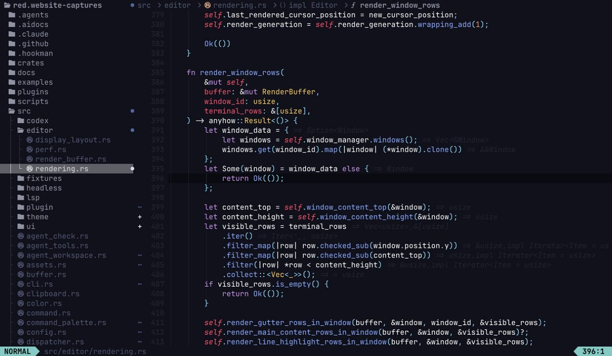
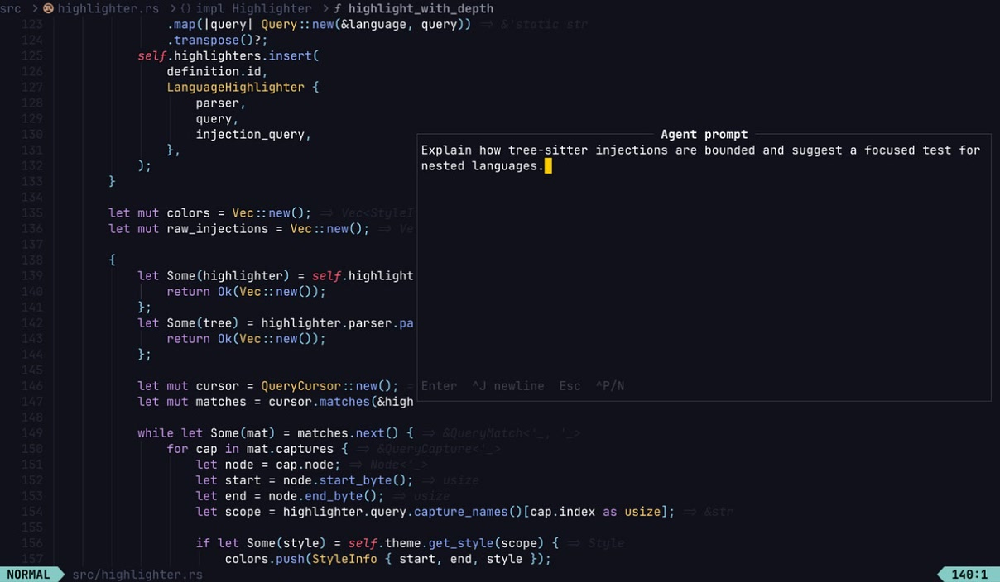

# red

[](https://github.com/codersauce/red/actions/workflows/ci.yml)
[](https://github.com/codersauce/red/actions/workflows/plugin-check.yml)
[](https://github.com/codersauce/red/actions/workflows/release.yml)
[](https://github.com/codersauce/red/releases/latest)
[](LICENSE)
[](https://discord.gg/5PWvAUNRHU)

> The modal editor for the agent era.

Fast, familiar editing with modern code intelligence and a safer way to work
with agents. One self-contained Rust binary. No required configuration. Your
files stay yours.

[Website](https://getred.dev) ·
[Download](https://github.com/codersauce/red/releases/latest) ·
[Getting started](docs/GETTING_STARTED.md) ·
[Documentation](#documentation) ·
[Community](https://discord.gg/5PWvAUNRHU)

<!-- current-release: 0.2.1 -->
The current documented release is
[v0.2.1](https://github.com/codersauce/red/releases/tag/v0.2.1).



## Install

### Homebrew

```shell
brew install codersauce/tap/red
```

### macOS and Linux

```shell
curl --proto '=https' --tlsv1.2 -fsSL https://getred.dev/install.sh | sh
```

The installer selects the correct macOS or x86_64 glibc Linux archive, verifies
its published SHA-256 checksum, installs to `~/.local/bin`, and runs Red's
built-in self-check.

### Windows

```powershell
irm https://getred.dev/install.ps1 | iex
```

The PowerShell installer verifies the release checksum, installs to
`%LOCALAPPDATA%\Programs\Red\bin`, and adds that directory to your user PATH.

To pin a release or choose another directory:

```shell
RED_VERSION=0.2.1 RED_INSTALL_DIR="$HOME/bin" \
  sh -c "$(curl --proto '=https' --tlsv1.2 -fsSL https://getred.dev/install.sh)"
```

You can also download a
[prebuilt archive](https://github.com/codersauce/red/releases/latest) or
[build from source](#development). Red's editor, default configuration, themes,
and plugins are bundled into the executable.

Agent support is optional. It requires Codex CLI 0.144.1 or newer and a
completed `codex login`.

## Why Red

- **Stay in flow.** Vim-inspired modes, motions, text objects, splits, and
  pickers are paired with tree-sitter highlighting and asynchronous language
  tools.
- **Find the signal.** Jump to files, commands, symbols, definitions,
  references, diagnostics, or Git changes without leaving the keyboard.
- **Make it yours.** Embedded Husk plugins power the file tree, project search,
  Git workspace, and theme browser. Defaults work immediately; configuration
  remains optional.
- **Keep the final say.** Red gives Codex editor context, including unsaved
  buffers, while staging every suggested write as an isolated proposal for
  explicit review.
- **Work reliably.** Atomic recovery works across platforms, and Unix
  detach/attach sessions preserve buffers, plugins, LSP state, and running
  agents across terminal or SSH disconnects.

## First five minutes

Open a file:

```shell
red path/to/file
```

Red offers to create a starter config on the first interactive run. Declining
is fine: the embedded defaults, plugins, and themes are enough to start editing.

| Key | Action |
| --- | --- |
| `Space ?` | Discover commands and their effective keymaps |
| `Ctrl-p` | Find a file with fuzzy search and live preview |
| `Space G` | Open the Git status workspace |
| `Space A` | Ask the agent with editor context |
| `:AgentReview` | Review pending agent proposals |
| `Space t` | Browse themes with live preview |

See [Getting started](docs/GETTING_STARTED.md) for editing, navigation,
configuration, language servers, Git, CLI, and troubleshooting guidance. The
[Vim compatibility matrix](docs/VIM_COMPATIBILITY.md) is the precise,
versioned behavior contract.

## A safer agent workflow



Every agent edit is a proposal. Nothing touches your files until you accept it.

1. **Ask.** Open the agent with `Space A`; Red includes a bounded selection or
   cursor excerpt, unsaved contents, and relevant diagnostics.
2. **Review.** Codex reads editor state and stages attributed changes in an
   isolated proposal filesystem. Open them with `:AgentReview`.
3. **Decide.** Accept the useful hunks and reject the rest. Codex does not
   silently write into the workspace.

The integration uses the Codex app-server directly and supports persistent
conversation, queued follow-ups, live tool progress, and explicit session
controls. Ignored, out-of-workspace, binary, and common secret files are
excluded from context. Read the
[agent workflow and safety contract](docs/AGENT_WORKFLOW.md) for prerequisites,
limits, commands, and failure behavior.

## What Red ships today

The current release includes:

- Normal, Insert, Visual, Visual Line, Visual Block, and Command modes with
  expanding Vim motion and editing compatibility
- tree-sitter highlighting for Rust, Markdown, JavaScript, TypeScript/TSX,
  JSON, TOML, YAML, Python, Bash, PowerShell, Lua, and Husk
- built-in LSP defaults for Rust, TypeScript/JavaScript, Python, Markdown, JSON,
  TOML, YAML, and Lua
- command and keymap discovery, fuzzy files, buffer navigation, symbols,
  references, project search, and diagnostics
- native Git gutter signs, hunk actions, and a full-screen workspace for
  staging, commits, branches, remotes, stashes, logs, and rebases
- an embedded Husk runtime with bundled file tree, search, Git, progress,
  inlay-hint, symbol, theme, and agent plugins
- a branded startup splash, the Red theme, accessible selection and cursor
  contrast, and optimized rendering hot paths
- atomic crash recovery on every platform and detachable sessions on macOS and
  Linux

See the [latest release notes](https://github.com/codersauce/red/releases/latest)
or the [complete changelog](CHANGELOG.md) for details.

## Configuration

Red layers your settings over embedded defaults, so a configuration file can
contain only the values you want to change:

```toml
# ~/.config/red/config.toml
theme = "red.json"
scrolloff = 8

[search]
ignorecase = true
smartcase = true

[keys.normal]
"Ctrl-s" = "Save"
```

The commented [`default_config.toml`](default_config.toml) documents every
setting that ships with Red. Custom themes go in `~/.config/red/themes/`, and
custom Husk plugins go in `~/.config/red/plugins/`. Run `red --runtime-files`
to see every visible runtime asset and its source.

## Plugins and themes

Bundled plugins and themes are embedded in the binary and upgrade with Red.
They are parsed and typechecked against the versioned Husk host contract before
activation; an incompatible plugin is quarantined without preventing editor
startup.

You can disable bundled plugins, configure them in `config.toml`, or eject a
copy for customization:

```shell
red --eject plugins/fidget.hk
red --eject themes/red.json
```

An ejected asset shadows the bundled copy until you delete it. See the
[plugin system guide](docs/PLUGIN_SYSTEM.md), [host API](docs/PLUGIN_API.md),
and [bundled plugin source](plugins/) for details and examples.

## Sessions

On macOS and Linux:

```shell
red --detach path/to/file
red --detach=work path/to/project
red --attach work
```

Leave a detachable session with `Ctrl-\`. Read
[Detachable sessions](docs/DETACH.md) and
[Session recovery](docs/SESSION_RECOVERY.md) for lifecycle, recovery, and
platform details.

## Documentation

| Guide | Covers |
| --- | --- |
| [Getting started](docs/GETTING_STARTED.md) | Editing, keymaps, LSP, Git, CLI, and troubleshooting |
| [Vim compatibility](docs/VIM_COMPATIBILITY.md) | Supported behavior and intentional differences |
| [Agent workflow](docs/AGENT_WORKFLOW.md) | Codex prerequisites, review model, commands, and safety |
| [Plugin system](docs/PLUGIN_SYSTEM.md) | Husk lifecycle, runtime architecture, and validation |
| [Plugin API](docs/PLUGIN_API.md) | Versioned host API for plugin authors |
| [Detach and attach](docs/DETACH.md) | Persistent Unix sessions |
| [Session recovery](docs/SESSION_RECOVERY.md) | Atomic recovery and dirty-buffer restoration |
| [Performance](docs/performance.md) | Measurement, budgets, and regression process |
| [Releasing](docs/RELEASING.md) | Release preparation, publication, and verification |

## Status and community

Red is an early, pre-1.0 release and is evolving quickly. Bring curiosity and
keep backups for critical work.

- Follow development on the
  [CoderSauce YouTube channel](https://youtube.com/@CoderSauce).
- Join the [Discord community](https://discord.gg/5PWvAUNRHU).
- Report bugs and request features in
  [GitHub Issues](https://github.com/codersauce/red/issues).

## Development

Red requires a recent stable Rust toolchain and Git:

```shell
git clone https://github.com/codersauce/red.git
cd red
cargo build
cargo test --all-targets --all-features
cargo clippy --all-targets --all-features -- -D warnings
```

Use `RED_RUNTIME=.` while iterating on bundled plugins or themes without
rebuilding the executable:

```shell
RED_RUNTIME=. cargo run -- path/to/file
```

Contributions are welcome. For major changes, open an issue before investing in
an implementation. Release maintainers should follow
[`docs/RELEASING.md`](docs/RELEASING.md).

## License

Red is available under the [MIT License](LICENSE).

Built with love for the Rust community and inspired by Vim, Neovim, and Helix.
