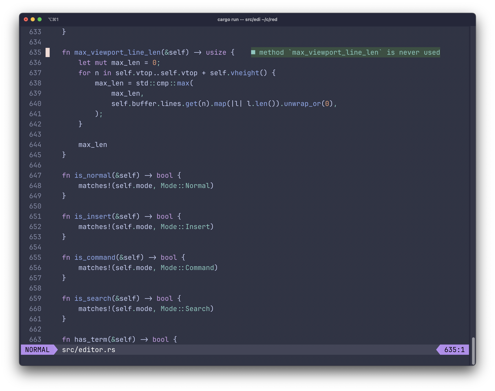

# red - Rusty Editor

[](https://github.com/codersauce/red/actions/workflows/ci.yml)
[](https://github.com/codersauce/red/actions/workflows/plugin-check.yml)
[](https://github.com/codersauce/red/actions/workflows/release.yml)
[](https://www.rust-lang.org)
[](https://opensource.org/licenses/MIT)
[](https://discord.gg/5PWvAUNRHU)

A modern, modal text editor built in Rust. Red combines Vim-inspired editing with modern features - Language Server Protocol support, tree-sitter syntax highlighting, and a sandboxed JavaScript/TypeScript plugin system - in a single self-contained binary that works with zero setup.



## Features

- **Modal Editing**: Vim-inspired Normal, Insert, Visual, Visual Line, Visual Block, and Command modes
- **Language Server Protocol**: Code completion, diagnostics, hover documentation, goto definition, find references, document and workspace symbols, and inlay hints, with sensible defaults for seven common language servers
- **Syntax Highlighting**: Tree-sitter based highlighting for Rust, Markdown, JavaScript, TypeScript/TSX, JSON, TOML, YAML, Python, Bash, and PowerShell
- **Windows and Buffers**: Horizontal/vertical splits with independent viewports, multiple buffers, and a jump list
- **Plugin System**: JavaScript and TypeScript plugins in a sandboxed Deno runtime, with a typed API - the file tree, project search, and theme browser are all plugins
- **Theme Support**: VSCode theme compatibility, with a large collection of themes built in
- **Self-Contained**: Default config, themes, and plugins are bundled into the binary - no setup required
- **Async Architecture**: Built on Tokio for responsive, non-blocking operations
- **Cross-Platform**: Works on Linux, macOS, and Windows

## Current Status

This editor is being actively built on a series of streams and videos published to my CoderSauce YouTube channel here:

https://youtube.com/@CoderSauce

It is my intention to keep it stable starting at the first alpha release, but there are no guarantees. As such, use it at your discretion. Bad things can happen to your files, so don't use it yet for anything critical.

If you want to collaborate or discuss red's features, usage or anything, join our Discord:

https://discord.gg/5PWvAUNRHU

## Installation

### Homebrew

```shell
brew install codersauce/tap/red
```

### Prebuilt Binaries

Download the archive for your platform from the [latest GitHub release](https://github.com/codersauce/red/releases/latest), extract `red` or `red.exe`, and place it somewhere on your PATH.

### Requirements for Source Builds

- A recent stable Rust toolchain (install via [rustup](https://rustup.rs))
- Git

### From Source

1. Clone the repository:
```shell
git clone https://github.com/codersauce/red.git
cd red
```

2. Build and install:
```shell
cargo install --path .
```

That's it. No configuration step is needed - the default config, themes, and plugins are bundled into the binary.

### Quick Start

Once installed, you can start editing files immediately:

```shell
red <file-to-edit>
```

On the first interactive run, Red offers to create a starter config at `~/.config/red/config.toml`. You can decline (or run non-interactively) and Red launches with its embedded defaults - a config file is entirely optional.

## A Tour of the Basics

Red uses Vim-style modal editing. Everything below is the default; all of it can be remapped (see [Configuration](#configuration)).

### Moving around

- `h/j/k/l` or arrow keys - Move left/down/up/right
- `w/b` - Move forward/backward by word
- `0/$` - Move to beginning/end of line
- `gg/G` - Go to first/last line
- `Ctrl-b/Ctrl-f` - Page up/down
- `zz` - Center the current line in the view
- `%` - Jump to the matching bracket (`g%` backward, `[%`/`]%` for unmatched brackets)
- `Ctrl-o/Tab` - Jump back/forward through the jump list
- `gj/gk` - Move by screen line when long lines wrap

### Editing

- `i/a` - Insert before/after the cursor (`I/A` for start/end of line)
- `o/O` - Open a new line below/above
- `x` - Delete character; `dd` - delete line; `dw` - delete word
- `u` / `Ctrl-r` - Undo/redo
- `p/P` - Paste after/before
- `>>` / `<<` - Indent/unindent the current line
- `Esc` - Back to Normal mode

### Selecting

- `v` - Visual mode (character-wise)
- `V` - Visual Line mode
- `Ctrl-v` - Visual Block mode (rectangular selections; `I` inserts on every selected line)
- In Visual mode, `i`/`a` select inside/around a text object: `iw` for a word, `i(`, `i[`, `i{`, `i<`, `i"`, `i'`, or `` i` `` for delimited text, and `a%` for a matchit pair
- In a selection: `y` copies, `x` deletes, `p` pastes over it

### Searching

- `/` and `?` - Forward/backward search with live preview and highlighted matches
- `n/N` - Repeat search in the same/opposite direction
- `*` - Search for the word under the cursor
- `:noh` - Clear search highlights

Search patterns use Rust regex syntax. Behavior (`incsearch`, `hlsearch`, `wrapscan`, `ignorecase`, `smartcase`) is configurable. The bundled `cool_search` plugin clears highlights automatically once you move away from a committed match or enter Insert mode.

### Code intelligence (LSP)

- `K` - Hover documentation
- `gd` - Go to definition
- `Ctrl-Space` - Trigger completion (in Insert mode; completion also triggers as you type)
- `Ctrl-t` - Document symbols picker
- `Space w` - Workspace symbols picker
- `Space k` - Find references

Diagnostics from the language server are displayed inline, and LSP progress is shown by the bundled `fidget` plugin.

### Pickers and panels

- `Ctrl-p` - File picker (`Ctrl-e` toggles hidden and ignored files while open)
- `Ctrl-e` - File tree (neotree)
- `Ctrl-j` or `Space b` - Buffer picker
- `Space g` - Project-wide search (requires `rg` on your PATH)
- `Space t` - Theme browser with live preview

### Windows and buffers

- `Ctrl-w s` / `Ctrl-w v` - Split horizontally/vertically
- `Ctrl-w h/j/k/l` - Move between windows
- `Ctrl-w w` - Next window; `Ctrl-w c` - close window
- `Ctrl-w =` / `Ctrl-w _` / `Ctrl-w o` - Balance/maximize/keep only the current window
- `Space Space` or `Space n` / `Space p` - Next/previous buffer

### Command mode

Enter Command mode with `:` (or `;`).

- `:w [file]` - Save (optionally to a new name); `:wq` - save and quit
- `:q` / `:q!` - Quit / quit discarding changes
- `:e <file>` - Open a file; `:e!` - reload the current file
- `:<number>` / `:$` - Jump to a line / the last line
- `:bn` / `:bd` - Next/delete buffer (`Space p` goes to the previous buffer)
- `:sp [file]` / `:vs [file]` - Split horizontally/vertically
- `:close` / `:only` - Close the current window / keep only the current window
- `:noh` - Clear search highlights
- `:wrap` / `:nowrap` - Enable/disable line wrapping

## Configuration

Red works out of the box with sensible embedded defaults. To customize it, use a TOML configuration file at `~/.config/red/config.toml`.

Your config is layered **on top of** the embedded defaults: you only need to write the settings you want to change, and everything else keeps its default value. The starter config that Red offers to create on first run is a commented template to get you going - it is not the source of truth for defaults, so deleting it (or any setting in it) simply falls back to the built-in behavior.

```toml
# ~/.config/red/config.toml — only what you want to change
theme = "atom-one-dark.json"

scrolloff = 8

[search]
ignorecase = true
smartcase = true

# Remap or add keybindings; everything not listed keeps its default
[keys.normal]
"Ctrl-s" = "Save"
```

For the full set of options - cursor shapes per mode, wrapping and scrolling behavior, plugin settings, logging, and more - see the commented [`default_config.toml`](default_config.toml), which documents every default exactly as the binary ships it.

### Keybindings

Every mode has its own table (`[keys.normal]`, `[keys.insert]`, `[keys.visual]`, …). Bindings map a key to an editor action, a sequence of actions, a nested table for chords, or a plugin command:

```toml
[keys.normal]
"u" = "Undo"                                   # single action
"a" = [ { EnterMode = "Insert" }, "MoveRight" ]  # sequence
"g" = { "d" = "GoToDefinition" }               # chord: g then d
"Ctrl-j" = { PluginCommand = "BufferPicker" }  # plugin command
```

### Language servers

Built-in LSP defaults cover Rust (`rust-analyzer`), TypeScript/JavaScript (`typescript-language-server`), Python (`pyright`), Markdown (`marksman`), JSON, TOML, YAML, and Lua (`lua-language-server`). Servers start only when a matching file is opened, and each one must be installed and on your PATH. Add or override servers in your config:

```toml
[lsp.servers.go]
command = "gopls"
language_id = "go"
file_extensions = ["go"]
root_markers = ["go.mod", ".git"]
```

### Plugin settings

Bundled plugins are enabled by default. Disable any of them by name, and configure the ones that take options:

```toml
disabled_plugins = ["barbecue"]

[plugin_config.lsp_symbols.icons]
enabled = false
```

Plugins that spawn external processes need an explicit allowlist, e.g. `project_search` ships with `[plugin_permissions.project_search] process = ["rg"]`.

### Git integration

The bundled `git` plugin provides native gutter signs and a full-screen status
workspace. Open it with `Space G`; use `[h` and `]h` to move between hunks, and
`Space h s`, `Space h u`, or `Space h r` to stage, unstage, or reset the current
hunk. Commit messages open in a regular Red scratch buffer; use `Space c c` to
submit or `Space c q` to cancel. The dashboard shows staged, unstaged, untracked, and conflicted files with
an adaptive diff pane and exposes commit, synchronization, branch, remote, tag,
stash, worktree, log, reset, and interactive-rebase actions. Git credentials are
handled by your existing SSH agent or Git credential helper.

Signs render in a dedicated two-cell column before line numbers. Their colors
come from the active theme's Git decoration colors. Override the normal or
staged glyphs through `[plugin_config.git.signs]` and
`[plugin_config.git.signs_staged]`; each glyph must occupy one or two terminal
cells.

### Command-line options

```
red [files...]              # open one or more files
red -r <path>               # set the working directory root
red -c 'wrap = false'       # inline TOML config override (repeatable)
red --version               # print the installed version
red --runtime-files         # list visible plugins/themes and their sources
red --eject <asset>         # copy a bundled plugin/theme into your config dir
```

### Themes

Red ships with a collection of VSCode-compatible themes bundled into the binary - they work without any files on disk. Reference a theme in your config:

```toml
theme = "your_theme_name.json"  # the theme's filename
```

To add your own theme, place a `.json` theme file in `~/.config/red/themes/`. Run `red --runtime-files` to see every theme Red can currently load, or browse them interactively with `Space t`.

## Bundled Plugins and Themes

Red's default plugins and themes are embedded in the binary, so a fresh install has everything it needs and upgrades automatically pick up newer bundled versions. Nothing is copied to your config directory unless you ask for it.

The bundled plugins:

| Plugin ID | File | What it does |
|-----------|------|--------------|
| `barbecue` | `barbecue.js` | Breadcrumb bar showing your current location in the code |
| `buffer_picker` | `buffer_picker.js` | Quick switcher for open buffers |
| `cool_search` | `cool_search.js` | Clears search highlights automatically when you move on |
| `fidget` | `fidget.js` | LSP progress indicator |
| `git` | `git.js` | Git signs, status dashboard, workflows, and history tools |
| `indent_guides` | `indent_guides.js` | Vertical indentation guides |
| `inlay_hints` | `inlay_hints.js` | Inline LSP type and parameter hints |
| `lsp_symbols` | `lsp_symbols.ts` | Document and workspace symbol pickers |
| `neotree` | `neotree.js` | File tree with git status and file icons |
| `project_search` | `project_search.js` | Project-wide text search powered by ripgrep |
| `session_restore` | `session_restore.js` | Reopens your files and layout from the last session |
| `theme_browser` | `theme_browser.js` | Theme picker with live preview |

To turn one off, add its plugin ID to `disabled_plugins` in your config, e.g. `disabled_plugins = ["fidget"]`.

### Seeing what's available

```shell
red --runtime-files
```

This lists every plugin and theme Red can see and where each one comes from (your config directory, `$RED_RUNTIME`, or the embedded assets). When the same filename exists in more than one place, the listing shows which source wins.

### Overriding a bundled asset

Files in your config directory take precedence over bundled ones with the same filename. For example, `~/.config/red/plugins/fidget.js` replaces the bundled `fidget.js`.

To start from the bundled version, *eject* a copy into your config directory:

```shell
red --eject plugins/fidget.js   # copy a bundled plugin for editing
red --eject themes/mocha.json   # copy a bundled theme for editing
red --eject fidget.js           # the plugins/ or themes/ prefix is optional
```

Eject refuses to overwrite an existing file; use `red --eject-force <asset>` to replace your copy with the bundled version.

Keep in mind that an ejected file shadows the bundled one permanently - if a later Red release improves that plugin or theme, your copy still wins. Delete the file from your config directory to go back to the bundled version.

### Advanced: `$RED_RUNTIME`

Packagers and developers working from a source checkout can point `$RED_RUNTIME` at a directory containing `plugins/` and `themes/` subdirectories. Assets are resolved in this order:

1. Your config directory (e.g. `~/.config/red/plugins/foo.js`)
2. `$RED_RUNTIME/plugins/foo.js` or `$RED_RUNTIME/themes/foo.json`
3. The assets embedded in the binary

Normal users don't need to set this - the embedded assets cover everyday use.

## Writing Plugins

Plugins are JavaScript or TypeScript files running in a sandboxed Deno runtime. A plugin exports an `activate` function and gets a typed `red` API object:

```javascript
export async function activate(red) {
    red.addCommand("HelloWorld", async () => {
        const { x, y } = await red.getCursorPosition();
        red.insertText(x, y, "Hello from a plugin!");
    });
}
```

Commands registered this way can be bound to keys with `{ PluginCommand = "HelloWorld" }`.

The API covers buffer access, cursor control, pickers and dialogs, per-window bars, virtual text decorations, events, LSP queries, timers, persistent storage, and permission-gated process spawning. TypeScript definitions are available in [`types/red.d.ts`](types/red.d.ts) (published as `@red-editor/types`).

See [`docs/PLUGIN_SYSTEM.md`](docs/PLUGIN_SYSTEM.md) for the full plugin development guide, and the [bundled plugins](plugins/) for real-world examples.

## Development

### Building from Source

```shell
# Clone the repository
git clone https://github.com/codersauce/red.git
cd red

# Build debug version
cargo build

# Build release version
cargo build --release

# Run tests
cargo test

# Run with debug logging
RUST_LOG=debug cargo run -- test.txt
```

When iterating on bundled plugins or themes, point `$RED_RUNTIME` at your checkout to use the working-tree files without rebuilding:

```shell
RED_RUNTIME=. cargo run -- test.txt
```

### Project Structure

```
red/
├── src/
│   ├── main.rs           # Entry point and event loop
│   ├── editor.rs         # Core editor state machine
│   ├── buffer.rs         # Text buffer management
│   ├── lsp/              # Language Server Protocol implementation
│   ├── ui/               # Terminal UI components
│   └── plugin/           # Plugin runtime
├── plugins/              # Built-in plugins (bundled into the binary)
├── themes/               # Default themes (bundled into the binary)
├── types/                # TypeScript definitions for the plugin API
├── docs/                 # Plugin system and internals documentation
└── tests/                # Integration tests
```

### Contributing

Contributions are welcome! Please feel free to submit a Pull Request. For major changes, please open an issue first to discuss what you would like to change.

1. Fork the repository
2. Create your feature branch (`git checkout -b feature/amazing-feature`)
3. Commit your changes (`git commit -m 'Add some amazing feature'`)
4. Push to the branch (`git push origin feature/amazing-feature`)
5. Open a Pull Request

### Preparing a Release

Release changelogs are generated from Conventional Commit subjects with
[`git-cliff`](https://git-cliff.org/) and committed in [`CHANGELOG.md`](CHANGELOG.md).
To prepare a release, run the **Prepare Release** workflow with the next semantic
version without a `v` prefix. The workflow updates `Cargo.toml`, `Cargo.lock`, and
the changelog, then opens a ready-for-review `release/vX.Y.Z` pull request.

After that pull request is reviewed, passes CI, and is merged, create and push an
annotated `vX.Y.Z` tag on the merge commit. The tag builds the release artifacts,
runs each packaged binary's embedded-runtime self-check on its target platform,
and creates the draft GitHub release using the matching `CHANGELOG.md` section.

The release-preparation workflow requires a `RELEASE_PR_TOKEN` fine-grained token
with repository-scoped Contents and Pull requests read/write permissions so its
pull request triggers the normal CI workflow.

## Troubleshooting

### Debug Mode

Red logs to `/tmp/red.log` by default. Override `log_file` in your config to change the path:

```toml
log_file = "~/red.log"
```

Then check the log file:
```shell
tail -f /tmp/red.log
```

### Common Issues

- **LSP not working**: Ensure the language server for your file type is installed and in your PATH
- **Plugins not loading**: Run `red --runtime-files` to check that the plugin is visible and which source (config directory, `$RED_RUNTIME`, or embedded) is being used
- **Theme not found**: Run `red --runtime-files` to confirm the theme name; custom themes in `~/.config/red/themes/` must be valid JSON
- **A bundled plugin/theme behaves like an old version**: An ejected copy in your config directory shadows the bundled one - delete it or re-eject with `red --eject-force`

## Reporting Issues

If you find any issues, please report them at:

https://github.com/codersauce/red/issues/

Check existing issues first to avoid duplicates.

## License

This project is licensed under the MIT License - see the [LICENSE](LICENSE) file for details.

## Acknowledgments

- Built with love for the Rust community
- Inspired by Vim, Neovim, and Helix
- Special thanks to all contributors and the CoderSauce community

Thank you for trying Red! ❤️
