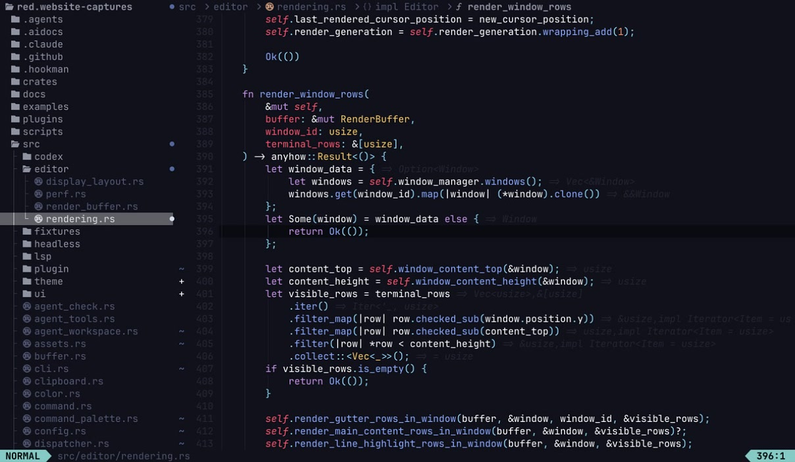
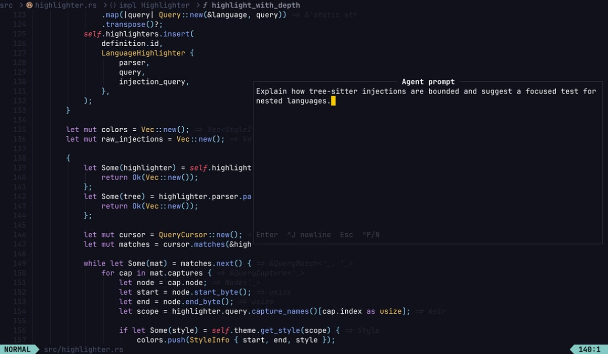

# red

[](https://github.com/codersauce/red/actions/workflows/ci.yml)
[](https://github.com/codersauce/red/actions/workflows/plugin-check.yml)
[](https://github.com/codersauce/red/actions/workflows/release.yml)
[](https://github.com/codersauce/red/releases/latest)
[](LICENSE)
[](https://discord.gg/5PWvAUNRHU)

> The Vim-style terminal editor where your coding agent works through your editor.

Vim muscle memory, editor-aware Codex agents, focused inline assistance, and
modern code intelligence in one self-contained Rust binary. Red works without
configuration; optional agent support requires an installed, authenticated Codex CLI.

[Website](https://getred.dev) ·
[Download](https://github.com/codersauce/red/releases/latest) ·
[Getting started](docs/GETTING_STARTED.md) ·
[Documentation](#documentation) ·
[Community](https://discord.gg/5PWvAUNRHU)

<!-- current-release: 0.6.0 -->
The current documented release is
[v0.6.0](https://github.com/codersauce/red/releases/tag/v0.6.0).



## Install

### Homebrew

```shell
brew install codersauce/tap/red
```

### macOS and Linux

```shell
curl --proto '=https' --tlsv1.2 -fsSL https://getred.dev/install.sh | sh
```

The installer selects the correct macOS or x86_64 glibc Linux archive, verifies
its published SHA-256 checksum, installs to `~/.local/bin`, and runs Red's
built-in self-check.

### Windows

```powershell
irm https://getred.dev/install.ps1 | iex
```

The PowerShell installer verifies the release checksum, installs to
`%LOCALAPPDATA%\Programs\Red\bin`, and adds that directory to your user PATH.

To pin a release or choose another directory:

```shell
RED_VERSION=0.6.0 RED_INSTALL_DIR="$HOME/bin" \
  sh -c "$(curl --proto '=https' --tlsv1.2 -fsSL https://getred.dev/install.sh)"
```

You can also download a
[prebuilt archive](https://github.com/codersauce/red/releases/latest) or
[build from source](#development). Red's editor, default configuration, themes,
and plugins are bundled into the executable.

Agent support is optional. It requires Codex CLI 0.144.1 or newer and a
completed `codex login`.

## Why Red

- **Keep your Vim muscle memory.** Familiar modes, motions, operators, text
  objects, splits, and keyboard-first pickers work alongside Tree-sitter and LSP.
- **Give your agent the real editor.** Codex sees open buffers, unsaved changes,
  diagnostics, and selections. Its validated edits pass through Red's editor
  transactions and save paths instead of modifying files behind the editor.
- **Ask right where you are.** Inline assistance reviews, explains, or refactors
  an exact selection or enclosing function; code changes stay unsaved and undoable.
- **Keep the whole workflow in your terminal.** File search, language servers,
  a full Git workspace, plugins, themes, and sessions are bundled with Red.
- **Reconnect without losing your work.** On macOS and Linux, detachable
  sessions retain buffers, plugins, LSP state, and running agents across
  terminal or SSH disconnects.

## Coming in the next release

The following capabilities are available on `main` and are **not included in
the published v0.6.0 release**:

- **An agent that points to the code it means.** Ask Agent to explain a
  subsystem, then follow links in its answer directly to source-anchored
  annotations. Choose the conversation's model and reasoning effort without
  changing your global Codex settings.
- **Real Vim-style multi-cursor editing.** Press `Ctrl-n` to select repeated
  occurrences or `Ctrl-Up` / `Ctrl-Down` for vertical cursors. Extend each
  selection with familiar motions and apply one Unicode-aware, undoable edit.
- **Inline help that gets out of the way.** Exact foreground edits can apply
  immediately while remaining unsaved; background and wider same-file edits
  always require explicit review. Keep the full history, inspect changes, or
  continue a discussion in Agent.
- **Your files stay protected when another tool changes them.** Clean buffers
  reload automatically. Dirty buffers keep both versions until you compare,
  reload, save elsewhere, or explicitly overwrite.
- **A faster, more complete editing workspace.** Browse large file trees,
  coordinate LSP and optional Copilot completions, and format supported
  pasted ranges.

These features become part of the supported release after the next version is
published. Until then, [build from source](#development) to try them.

## First five minutes

Open a file:

```shell
red path/to/file
```

On `main`, the first interactive launch offers a guided tour, release
highlights, and an immediate exit into the editor. The tour uses a disposable
practice buffer and safe Git/agent demonstrations; reopen it with `:welcome` or
`:tutorial`. This guided onboarding is coming in the next release.
Starter configuration remains optional: embedded defaults, plugins, and themes
are enough to begin editing.

| Key | Action |
| --- | --- |
| `Space ?` | Discover commands and their effective keymaps |
| `Space m` | Browse notifications and recent messages |
| `Ctrl-p` | Find a file with fuzzy search and live preview |
| `Ctrl-e`, then `/` | Open the file tree and search files or directories |
| `Space G` | Open the Git status workspace |
| `Space A` | Ask the agent with editor context |
| `Space i` | Review, explain, or refactor the enclosing function or exact selection |
| `Space t` | Browse themes with live preview |

See [Getting started](docs/GETTING_STARTED.md) for editing, navigation,
configuration, language servers, Git, CLI, and troubleshooting guidance. The
[Vim compatibility matrix](docs/VIM_COMPATIBILITY.md) is the precise,
versioned behavior contract.

## Agents that understand your editor



### The full Agent workspace

1. **Ask.** Press `Space A`; Red provides a bounded source excerpt, current
   selection, relevant diagnostics, and authoritative unsaved buffer contents.
2. **Work through the editor.** Codex reads and changes files only through
   Red's workspace-confined, revision-checked editor tools. Agent edits are
   attributed to their conversation and **saved to disk** through Red.
3. **Keep the conversation.** Follow tool progress, queue another request, and
   resume the same conversation without losing editor context. On `main`,
   source-linked annotations turn explanations into navigable code walkthroughs.

In v0.6.0, Red follows each file tool visually. On `main`, playback is optional
and disabled by default; set `[agent] follow_tool_calls = true` to reveal each
target and pause before the operation. Full Agent writes still save to disk in
both versions.

### Focused inline assistance

Press `Space i` to review, explain, or refactor the enclosing function, falling
back to the current line when syntax is unavailable. In Visual or Visual Line
mode, the target is exactly the selected text. Requests use an ephemeral Codex
thread with bounded read-only project context; visual-block targets are not
supported. Inline code edits form one **unsaved, undoable editor transaction**.

In v0.6.0, every inline code change requires explicit review. On `main`, an
exact-target edit may apply immediately when its original popup is in the
foreground; set `[agent] auto_apply_inline_edits = false` to review it first.
Background results and wider same-file proposals always require an explicit
review and approval. Use `Space H` to revisit inline history or `A` to prepare
a full Agent follow-up without sending it automatically.

The [agent workflow and safety contract](docs/AGENT_WORKFLOW.md) explains
prerequisites, path protections, exact boundaries, commands, and failure modes.

## What Red ships today

The current release includes:

- Normal, Insert, Visual, Visual Line, Visual Block, and Command modes with
  expanding Vim motion and editing compatibility
- tree-sitter highlighting for Rust, Markdown, JavaScript, TypeScript/TSX,
  JSON, TOML, YAML, Bash, PowerShell, Lua, and Husk
- a first-party Husk language server plus built-in LSP defaults for Rust,
  TypeScript/JavaScript, Markdown, JSON, TOML, YAML, and Lua
- command and keymap discovery, fuzzy files, buffer navigation, symbols,
  references, project search, and diagnostics
- native Git gutter signs, hunk actions, and a full-screen workspace for
  staging, commits, Codex-generated commit messages, branches, remotes,
  stashes, logs, and rebases
- a persistent full Agent workspace and bounded inline assistance with
  source-anchored comments, retained history, and reviewable local edits
- an embedded Husk runtime with bundled file tree, search, Git, progress,
  inlay-hint, symbol, theme, and agent plugins
- a branded startup splash, the Red theme, accessible selection and cursor
  contrast, and optimized rendering hot paths
- atomic crash recovery on every platform and detachable sessions on macOS and
  Linux

See the [latest release notes](https://github.com/codersauce/red/releases/latest)
or the [complete changelog](CHANGELOG.md) for details.

After installing a new version, Red opens a themed **What’s new** panel once.
Reopen it whenever you like with `:whats-new`, `:changelog`, or the command
palette. Release notes are bundled for offline use and refreshed from the exact
matching GitHub release in the background.

## Configuration

Red layers your settings over embedded defaults, so a configuration file can
contain only the values you want to change:

```toml
# ~/.config/red/config.toml
theme = "red.json"
scrolloff = 8
# Disable the automatic release panel or its optional GitHub refresh:
# show_whats_new = false
# fetch_release_notes = false

[search]
ignorecase = true
smartcase = true

[keys.normal]
"Ctrl-s" = "Save"
```

The commented [`default_config.toml`](default_config.toml) documents every
setting that ships with Red. Custom themes go in `~/.config/red/themes/`, and
custom Husk plugins go in `~/.config/red/plugins/`. Run `red --runtime-files`
to see every visible runtime asset and its source.

Add new highlighting, exact filenames, comment syntax, indentation, and language
servers through a unified `[languages.<id>]` configuration or an installable
language pack. Native Tree-sitter grammars require explicit digest-bound trust;
`:languages reload` applies validated changes without restarting the editor.
See the [language extensions guide](docs/LANGUAGES.md).

## Husk language

The source tree contains the extracted Husk embedding API, standalone CLI, local
package resolver, and portable WebAssembly Component extension runtime. Start
with the [language and embedding guide](docs/HUSK_LANGUAGE_GUIDE.md). The
[research and implementation plan](docs/HUSK_LANGUAGE_EXTRACTION_PLAN.md) and
[card-by-card status](docs/HUSK_IMPLEMENTATION_STATUS.md) explain the dynamic
Rust-crate design, completed work, and remaining release-hardening tasks.

## Plugins and themes

Bundled plugins and themes are embedded in the binary and upgrade with Red.
They are parsed and typechecked against the versioned Husk host contract before
activation; an incompatible plugin is quarantined without preventing editor
startup.

You can disable bundled plugins, configure them in `config.toml`, or eject a
copy for customization:

```shell
red --eject plugins/fidget.hk
red --eject themes/red.json
```

An ejected asset shadows the bundled copy until you delete it. See the
[plugin system guide](docs/PLUGIN_SYSTEM.md), [host API](docs/PLUGIN_API.md),
and [bundled plugin source](plugins/) for details and examples.

## Sessions

On macOS and Linux:

```shell
red --detach path/to/file
red --detach=work path/to/project
red --attach work
```

Leave a detachable session with `Ctrl-\`. Read
[Detachable sessions](docs/DETACH.md) and
[Session recovery](docs/SESSION_RECOVERY.md) for lifecycle, recovery, and
platform details.

## Documentation

| Guide | Covers |
| --- | --- |
| [Getting started](docs/GETTING_STARTED.md) | Editing, keymaps, LSP, Git, CLI, and troubleshooting |
| [Husk language server](docs/HUSK_LSP.md) | Husk editor features, external crates, configuration, and safety boundaries |
| [Language extensions](docs/LANGUAGES.md) | Custom syntax, trusted Tree-sitter grammars, language packs, LSP settings, and live reload |
| [Vim compatibility](docs/VIM_COMPATIBILITY.md) | Supported behavior and intentional differences |
| [Agent workflow](docs/AGENT_WORKFLOW.md) | Codex prerequisites, review model, commands, and safety |
| [Plugin system](docs/PLUGIN_SYSTEM.md) | Husk lifecycle, runtime architecture, and validation |
| [Plugin API](docs/PLUGIN_API.md) | Versioned host API for plugin authors |
| [Detach and attach](docs/DETACH.md) | Persistent Unix sessions |
| [Session recovery](docs/SESSION_RECOVERY.md) | Atomic recovery and dirty-buffer restoration |
| [Performance](docs/performance.md) | Measurement, budgets, and regression process |
| [Debugging](docs/DEBUGGING.md) | Invariant owners, logs, diagnostic commands, and tracing paths |
| [Releasing](docs/RELEASING.md) | Release preparation, publication, and verification |

## Status and community

Red is an early, pre-1.0 release and is evolving quickly. Bring curiosity and
keep backups for critical work.

- Follow development on the
  [CoderSauce YouTube channel](https://youtube.com/@CoderSauce).
- Join the [Discord community](https://discord.gg/5PWvAUNRHU).
- Report bugs and request features in
  [GitHub Issues](https://github.com/codersauce/red/issues).

## Development

Red requires a recent stable Rust toolchain and Git:

```shell
git clone https://github.com/codersauce/red.git
cd red
cargo build
cargo test --all-targets --all-features
cargo clippy --all-targets --all-features -- -D warnings
```

Use narrower commands while iterating on a specific crate or test:

```shell
cargo test -p red --lib editor::tests::
cargo test --workspace --exclude red --all-features --tests
python3 scripts/doctest_packages.py --no-default-features
```

`cargo test` is the default runner because Red's many short tests complete
faster in shared test-binary processes. Install `cargo-nextest` when per-test
isolation, timing, retries, or JUnit reports are useful, then compare both
runners with `python3 scripts/test_performance.py --runner both --timings`.
Add `--package husk-lexer` for a short, focused comparison.
The manual **Rust Test Performance** GitHub Actions workflow provides the same
comparison on Linux, macOS, or Windows and can optionally enable `sccache` or
the Linux `mold` linker.

Use `RED_RUNTIME=.` while iterating on bundled plugins or themes without
rebuilding the executable:

```shell
RED_RUNTIME=. cargo run -- path/to/file
```

Contributions are welcome. For major changes, open an issue before investing in
an implementation. Release maintainers should follow
[`docs/RELEASING.md`](docs/RELEASING.md).

## License

Red is available under the [MIT License](LICENSE).

Built with love for the Rust community and inspired by Vim, Neovim, and Helix.
