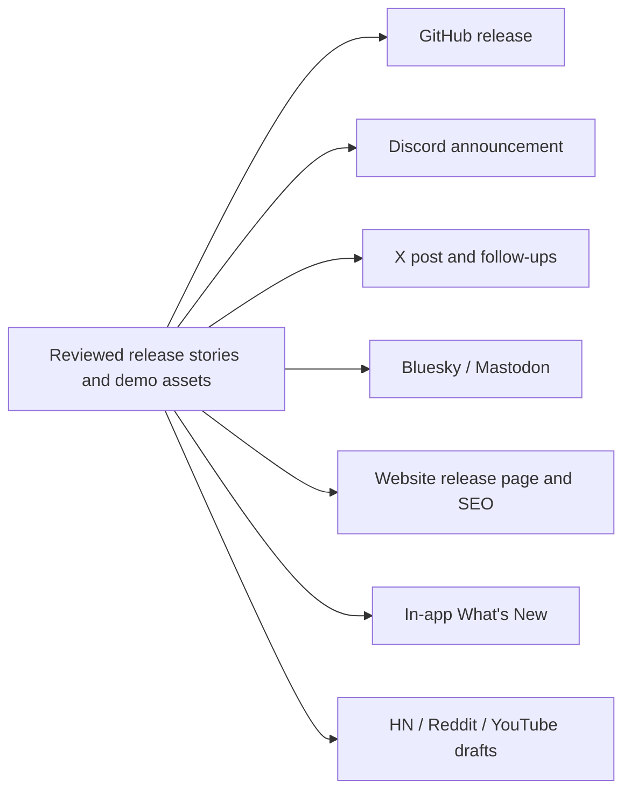

# Release Communications and Launch Strategy: Conversation Archive

> **Archived:** 2026-08-27
>
> **Scope:** The original release-communications audit, launch strategy,
> implementation handoff, branch locations, and resulting commit references.
> This archive preserves substantive user prompts and assistant answers. Tool
> output, intermediate progress messages, runtime configuration, and internal
> citation bookkeeping are intentionally omitted. Local machine paths have
> been normalized for portability.
>
> **Point-in-time context:** Release versions, public metrics, website state,
> branch status, and platform capabilities describe the conversation when it
> occurred. Recheck current state before acting on time-sensitive claims.

---

## 1. User — 2026-08-23T21:11:27.109Z

I will release a Red version soon and there will be a massive number of new features, improvements and fixes.

Can you review our release process but mostly the communications we do around each release, on GitHub release bodies and Discord announcements, and anything else I might be missing?

I feel like people don't know about how far we are, specially on the agentic side panel, inline agent and also feature parity to neovim and better yet, innovative features we might have.

I want to make it in a way that we get more hype for the cool features, improvements and bug fixes that really stand out.

Can you come up with ideas to improve it and add a new integrated way to also post to X and maybe even other places?

Don't limit yourself to these though, please be welcome to provide more ideas, suggestions and insights to make the full thing more "viral" if at all possible.

---

## 2. Assistant — 2026-08-23T21:20:42.081Z

### Red needs a launch system, not just better release notes

Red has a compelling story, but its release process currently turns that story into a chronological inventory of commits. The result is that some genuinely distinctive capabilities are effectively invisible.

My recommended positioning:

> **Red is the Vim-style terminal editor where your coding agent works through your editor, not around it.**

Supporting message:

> Vim muscle memory. Editor-aware Codex agents. Focused inline assistance. One Rust binary.

That framing gives you three audiences simultaneously: Vim users, developers interested in agentic coding, and people who want a capable terminal editor without assembling a plugin stack.

#### What I found

As of August 23, the latest published release is [Red v0.6.0](https://github.com/codersauce/red/releases/tag/v0.6.0), while `main` is already **100 commits ahead**:

- 35 feature-labeled commits.
- 44 fix-labeled commits.
- Five performance-labeled commits.
- The remainder are merges and other changes.

Those are commit categories, not a claim that there are exactly 35 distinct user-facing features.

The release mechanics themselves are solid: release-preparation PR, version synchronization, generated changelog, cross-platform builds, runtime checks, checksums, draft release, Homebrew updates, and automated Discord announcements. The process is documented in [RELEASING.md](../docs/RELEASING.md).

The communication layer is where things fall apart.

##### GitHub releases bury the best work

The v0.6.0 release opens with **23 bug-fix bullets**, followed by **41 feature bullets**. Within those features:

- Live agent-driven edits appear twelfth.
- Persistent agent conversations appear thirteenth.
- Inline assistance appears eighteenth.
- Inline history and source-linked comments appear twenty-fifth.
- Richer inline outcomes appear forty-first.

A visitor has to work unreasonably hard to discover what makes Red interesting.

The underlying issue is [cliff.release.toml](../cliff.release.toml): release sections are grouped alphabetically and commits are ordered oldest-first. That is useful provenance, but a poor product narrative.

##### Discord repeats the same editorial mistake

I reconstructed the current v0.6.0 announcement. Its five featured highlights are:

1. LSP diagnostic counts in the status line.
2. A diagnostic popup.
3. Modal editing inside the agent composer.
4. Diagnostic gutter signs.
5. General improvements to the agent pane.

The first “Fixes & polish” entry promotes **faster CI**.

Meanwhile, the announcement completely omits inline assistance, live agent edits, persistent conversations, source-linked comments, and Codex-generated commit messages.

The ranking vocabulary in [discord_release.py](../scripts/discord_release.py) does not include “agent,” “Codex,” “inline,” “Neovim,” or “multi-cursor.”

##### The website is substantially out of date

The separate [red-website repository](https://github.com/codersauce/red-website) was last updated July 25.

Its generated release metadata still says **v0.2.4**. A browser-side component fetches the latest release after the page loads, but search engines, server-rendered HTML, and structured metadata still receive the stale version.

Worse, both the [homepage](https://getred.dev/) and [documentation](https://getred.dev/docs) advertise an old proposal-review workflow and reference `:AgentReview`.

That no longer accurately describes the current full Agent panel:

- Full Agent edits go through Red’s validated editor tools and **are saved to disk**.
- Exact inline edits can apply immediately by default but remain **unsaved and undoable**.
- Wider inline edits require explicit review.
- Followed visual playback is configurable and currently **disabled by default**.

The actual behavior is documented in [AGENT_WORKFLOW.md](../docs/AGENT_WORKFLOW.md) and [default_config.toml](../default_config.toml).

This discrepancy is more than stale marketing. It misrepresents the product’s safety model.

There is also a structural reason the website stays stale: its tests literally assert that the version is `0.2.4`. Updating installer metadata without fixing those tests would fail CI.

##### Your strongest discovery surfaces are underused

Current GitHub snapshot:

- **219 stars.**
- **Four repository watchers.**
- **Zero repository topics.**
- Repository description: “Vimlike Modal Text Editor in Rust.”
- Repository homepage points to `rededitor.app`, while the documented canonical site is `getred.dev`.
- GitHub Discussions are disabled.

Over the last 14 days, GitHub recorded **218 page views from 73 unique visitors**. The latest release page had only **five unique visitors** in the popular-path report.

The latest release has **60 binary-archive downloads**. Those numbers are directional, not a complete installation count.

GitHub also reports thousands of clones, but that is likely inflated by CI and automation and should not be treated as user adoption.

#### The features that deserve the spotlight

I would organize the upcoming launch around five stories.

##### 1. “Your agent can point at the code it means”

The Agent panel can create source-linked annotations and include clickable links in its explanations. Clicking a link jumps directly to the relevant code and opens the associated annotation.

That is far more interesting than “improved agent pane.”

Suggested framing:

> Ask Codex to explain a subsystem, and its answer becomes a guided walkthrough through the actual source.

This is newly added in [PR #282](https://github.com/codersauce/red/pull/282).

##### 2. “An inline agent with a real memory”

`Space i` can provide focused reviews, explanations, source-anchored comments, and bounded refactors.

The broader workflow includes:

- Exact visual-selection boundaries.
- Review requirements for wider changes.
- Persistent inline discussion history.
- Reviewable diffs and change attribution.
- Background jobs.
- Escalation from inline assistance into the full Agent panel.

Much of this already exists in v0.6.0, but it has not been presented as a coherent product capability. Market it as something Red offers today, while identifying which improvements are actually new.

##### 3. “Vim-style multi-cursor editing, built in”

The upcoming release includes:

- `Ctrl-n` to select successive occurrences.
- `Ctrl-Up` and `Ctrl-Down` for vertical cursors.
- Extension with Vim motions.
- Unicode-aware editing.
- Changes grouped into one undoable operation.

This is genuinely prominent launch material, yet it currently does not appear in the README, getting-started guide, or Vim compatibility matrix.

See [PR #326](https://github.com/codersauce/red/pull/326) and [default_config.toml](../default_config.toml).

##### 4. “A proper agent workspace, not just a prompt”

The full panel supports persistent conversations, unsaved-buffer awareness, prompt history, queued follow-ups, source-linked walkthroughs, and per-conversation model/reasoning selection.

The model picker is new in [PR #273](https://github.com/codersauce/red/pull/273).

A particularly good message:

> Your agent sees the code you are actually editing, including changes you have not saved.

##### 5. “Terminal-editor capabilities people do not expect”

These deserve individual follow-up posts:

- **Detached agent sessions:** On macOS and Linux, disconnect from SSH and reconnect to the same running editor and agent. See [DETACH.md](../docs/DETACH.md).
- **Large repository performance:** The documented benchmark fully opens an 8,192-entry tree in 47.17 ms, with 0.566 ms p95 navigation under the recorded test conditions. See [the benchmark report](../docs/performance-neotree-unbounded-2026-08-21.md).
- **External-change protection:** Detect changes made outside Red, preserve unsaved work, and resolve conflicts explicitly. See [PR #330](https://github.com/codersauce/red/pull/330).
- **Coordinated LSP and Copilot completion:** An optional mode combines conventional completion with compatible AI suggestions. See [PR #281](https://github.com/codersauce/red/pull/281).
- **Interactive onboarding:** A guided first-run experience helps people understand the editor quickly.
- **Full Git workspace, Codex-generated commit messages, Tree-sitter text objects, crash recovery, and the Husk plugin runtime.**

The central distinction should be:

> **New in this release** versus **already possible in Red and worth finally showing properly**.

#### Build one editorial source of truth

I would add a small, human-reviewed release campaign manifest, something like:

```toml
version = "<next-version>"
tier = "landmark"
headline = "The modal editor where your coding agent works through your editor"
canonical_url = "https://getred.dev/releases/<next-version>"

[[stories]]
id = "source-linked-walkthroughs"
status = "new"
title = "Your agent can point at the code it means"
pull_requests = [282]
audiences = ["agent", "vim", "terminal"]
demo = "agent-walkthrough.mp4"

[[stories]]
id = "inline-agent"
status = "existing-improved"
title = "Focused inline reviews and refactors with persistent history"
audiences = ["agent", "vim"]
demo = "inline-agent.mp4"

[[stories]]
id = "multi-cursor"
status = "new"
title = "Real Vim-style multi-cursor editing"
pull_requests = [326]
audiences = ["vim", "editor"]
demo = "multi-cursor.mp4"
```

Then render every release surface from that reviewed manifest:



Keep the complete generated changelog underneath the editorial introduction. Contributor credit and detailed commit history remain intact.

##### Make the release-preparation PR include launch review

Extend the existing release checklist to require:

- Three to five reviewed flagship stories.
- Accurate “new” versus “already available” labels.
- A real demo clip or screenshot for each major story.
- Verified keyboard shortcuts and feature prerequisites.
- Accurate statements about saves, approvals, scope, and supported platforms.
- Website synchronization.
- Previewed Discord, X, and Bluesky copy.
- A checked social-preview image.
- Installation instructions tested against the actual release candidate.

This fits naturally into the current [release PR template](../.github/release-pr-body.md).

##### Fix the in-app “What’s New” panel too

Red already has a valuable distribution channel: its default-on release announcement inside the editor.

However, [whats_new.rs](../src/whats_new.rs) currently takes only the first five entries from conventional changelog sections. A beautifully written GitHub introduction would still disappear inside Red.

The same curated highlights should be embedded in the release binary for offline use and refreshed from the exact matching GitHub release when available.

Existing users should immediately see:

> New: source-linked Agent walkthroughs, Vim-style multi-cursor, model selection, faster large repositories.

#### Integrating X and other channels

| Channel | Recommended approach | What to publish |
|---|---|---|
| GitHub Releases | Automatically generated, editorially reviewed | Canonical release story, hero video, installation, detailed changelog |
| Website | Synchronize and deploy for each release | Search-indexable release page, current screenshots, accurate safety model |
| Discord | Automatic | Three strong highlights, one demo, installation command, discussion prompt |
| X | Approval-gated automatic publishing | Short founder-style post with native video; follow-up feature clips |
| Bluesky | Automatic or approval-gated | Native screenshot/video and a developer-focused explanation |
| GitHub Discussions | Optional | Searchable release discussion and feedback, if you want another maintained community surface |
| Reddit | Manual, tailored to each community | Specific demos for relevant Rust, Vim, terminal, or programming audiences |
| Hacker News | Manual | A substantive “Show HN” for the overall product or major overhaul |
| YouTube | Manual initially | One flagship walkthrough plus short clips showing individual workflows |
| DEV Community | Automatically prepared draft | A substantive technical article about editor-mediated agent workflows |
| Mastodon | Optional automatic publishing | Native screenshot/video if you establish an appropriate account |
| Product Hunt | Manual | Reserve for a genuinely major milestone with polished launch assets |

##### X integration is feasible

Use X’s official API with:

- OAuth authorization for the account that will publish.
- `tweet.write` and `media.write` permissions.
- `offline.access` for renewable credentials.
- Native video upload followed by post creation.
- Protected GitHub Actions secrets.
- A human approval gate before the first public post.
- Per-release delivery tracking to prevent duplicates.

X currently documents a **pay-per-use, prepaid-credit model with no monthly minimum**, but the actual endpoint prices are visible only in its Developer Console. Check the account’s current pricing before committing to the integration. [X API usage and billing](https://docs.x.com/x-api/fundamentals/post-cap), [X OAuth permissions](https://docs.x.com/fundamentals/authentication/oauth-2-0/authorization-code), [X media uploads](https://docs.x.com/x-api/media/quickstart/media-upload-chunked).

Do **not** automate the X website through browser scripting or repeatedly publish substantially identical posts. X explicitly prohibits both patterns. [X automation rules](https://help.x.com/en/rules-and-policies/x-automation).

##### Bluesky is the easiest additional social integration

Bluesky has a documented posting API with support for links, images, and rich embeds. Its published service limits are generous relative to a normal release workflow. [Bluesky posting guide](https://atproto.com/blog/create-post), [Bluesky rate limits](https://bsky.network/docs/rate-limits/).

##### Some channels should remain human-led

Hacker News explicitly says routine version updates generally do not qualify as Show HN, while a major overhaul can qualify. It also prohibits asking friends to vote or comment. Present Red itself and its distinctive workflows, rather than posting “Red vX.Y released.” [Show HN guidelines](https://news.ycombinator.com/showhn.html).

YouTube’s upload API is usable, but uploads from unaudited API projects are restricted to private visibility. Manual publication is the practical initial choice. [YouTube upload API](https://developers.google.com/youtube/v3/docs/videos/insert).

For Rust-specific distribution, **This Week in Rust currently says it no longer accepts direct submissions for its project/tooling updates section and instead monitors `r/rust`**. Its editors prefer substantial technical material over generic changelogs and ask for disclosure when an article is LLM-written. That makes a thoughtful, human-edited Rust engineering article considerably more useful than syndicating the release bullets. [This Week in Rust contribution guidelines](https://github.com/rust-lang/this-week-in-rust).

##### Preserve the current working release trigger

Today, a human publishes the draft release, so the existing `release.published` workflow runs correctly.

If release publication itself is later automated using GitHub’s built-in `GITHUB_TOKEN`, GitHub generally suppresses subsequent workflows triggered by that token. In that case, run announcement jobs within the publishing workflow, explicitly dispatch a second workflow, or use an appropriately scoped GitHub App token. [GitHub token workflow-trigger behavior](https://docs.github.com/en/actions/concepts/security/github_token).

GitHub environments can also require approval before publishing jobs receive their social-account credentials. [GitHub protected environments](https://docs.github.com/en/actions/reference/workflows-and-actions/deployments-and-environments).

#### What the actual announcement could look like

##### GitHub release opening

> # Red [version]: Vim muscle memory meets editor-aware agents
>
> Red is a fast, Vim-style terminal editor with a coding agent that understands the code you actually have open.
>
> This release introduces source-linked Agent walkthroughs, built-in Vim-style multi-cursor editing, conversation-specific model selection, stronger large-repository performance, and safer handling of externally modified files.
>
> **Three things to try first**
>
> 1. Ask Agent to explain a subsystem, then follow its links directly into annotated source.
> 2. Select code and press `Space i` for a focused review, explanation, or refactor.
> 3. Press `Ctrl-n` to select repeated occurrences and edit them together.
>
> **Install:** `brew install codersauce/tap/red`
>
> **Agent setup:** Install Codex separately and run `codex login`.

After that:

1. Embed the flagship demo.
2. Explain the five strongest stories with screenshots or short clips.
3. Clearly state the Agent versus inline safety behavior.
4. Summarize significant Vim-compatibility additions.
5. Highlight measured performance improvements.
6. Provide complete categorized changes and contributor credits.

##### Example X post

> I’m building Red: a Vim-style terminal editor with an agent that understands your editor.
>
> → Codex annotates the exact code it means
> → Scoped inline reviews and refactors
> → Ctrl-N multi-cursor
> → Agents survive SSH drops (macOS/Linux)
>
> https://getred.dev

Attach a short, captioned recording. The video should make the claim self-evident without requiring audio.

##### Example Discord announcement

> **Red [version] is out: agent-aware editing, real Vim multi-cursor, and a much smarter workspace.**
>
> **Try these first:**
>
> - Ask Codex to explain code and jump directly from its answer to source annotations.
> - Select code and press `Space i` for an inline review or focused refactor.
> - Press `Ctrl-n` to edit repeated occurrences together.
> - Choose the model and reasoning effort directly inside the Agent panel.
>
> Also included: faster large repositories, safer external-file conflict handling, improved LSP behavior, and dozens of fixes.
>
> `brew install codersauce/tap/red`
>
> **Which Neovim workflow should we make agent-aware next?**

That last question gives the announcement a useful conversational entry point without manufacturing engagement.

#### Make the launch visually convincing

Record one **30–45 second flagship demo**:

1. Open a real Rust file in Red.
2. Ask the Agent panel to explain a subsystem.
3. Click a response link and jump to an annotated source location.
4. Select code and use `Space i` for a comments-only review or bounded edit.
5. Use `Ctrl-n` to select multiple occurrences.
6. Show that one undo reverts the grouped edit.
7. End with the installation command.

Then create separate short clips for:

- Agent source walkthroughs.
- Inline review and retained history.
- Multi-cursor editing.
- Dropped-SSH session recovery.
- Model selection.
- Large-repository browsing.
- External-file conflict recovery.

Use real key overlays, captions, and actual release-candidate behavior. If showing followed agent playback, enable `follow_tool_calls` explicitly because it is not the default.

Also replace the GitHub repository social card with a feature-focused image. GitHub recommends **1280 × 640 pixels** for best display. [GitHub social preview guidance](https://docs.github.com/en/repositories/managing-your-repositorys-settings-and-features/customizing-your-repository/customizing-your-repositorys-social-media-preview).

#### Additional changes that would materially help

**Fix GitHub positioning immediately.** Update the description to something like:

> Vim-style terminal editor with Codex agents, inline AI review, LSP, Git, and one-binary setup.

Add relevant repository topics: `vim`, `neovim`, `modal-editor`, `terminal`, `tui`, `rust`, `code-editor`, `coding-agent`, `codex`, `lsp`, and `tree-sitter`.

**Make `getred.dev` the consistent public destination.** Update GitHub repository metadata, social links, release URLs, canonical pages, and campaign links accordingly.

**Move the main product story above Husk in the README.** Husk is interesting, but a new visitor should encounter the flagship editor and agent workflows before implementation-oriented language details.

**Create durable feature pages.** Pages such as `/agent`, `/inline`, `/vim`, `/sessions`, and `/releases/<version>` are easier to discover, share, and keep current than one large README.

**Turn Vim compatibility into a credibility asset.** Maintain a dated compatibility matrix, show supported behavior and intentional differences, and record short demonstrations of real Vim workflows.

However, the current matrix still says it was validated against Red 0.5.0, and the two required external Vim-user trials are unassigned in [VIM_DOGFOOD.md](../docs/VIM_DOGFOOD.md). Until that changes, avoid claiming complete or independently validated Neovim parity.

**Keep release messaging honest about prerequisites.** Red itself needs no required configuration, but the agent requires an installed and authenticated Codex CLI. Copilot is separately installed and opt-in. Detached sessions are macOS/Linux only.

**Introduce release tiers.** Landmark releases get a campaign, flagship video, social rollout, and community posts. Smaller releases get concise GitHub/Discord updates and perhaps one targeted social post. Not every patch needs a launch.

**Publish one release as several stories.** Launch the overall release first, then spend the following week showing one concrete workflow per day. This creates more opportunities for discovery without repeatedly posting the same announcement.

**Measure actual distribution.** Track release-page traffic, referring sites, release-asset downloads, channel-specific landing visits, and engagement on individual feature clips. Do not interpret automated clone counts as adoption, and avoid adding invasive editor telemetry.

#### Recommended implementation order

1. Correct the website’s outdated version, agent safety claims, and hard-coded version tests.
2. Refresh the README, compatibility matrix, GitHub description, homepage, topics, and social preview.
3. Add a reviewed release-campaign manifest and generate curated GitHub/Discord/in-app highlights from it.
4. Integrate approval-gated X publishing and Bluesky posting into the existing release-announcement workflow.
5. Synchronize and deploy the separate website repository for each published release.
6. Prepare tailored, human-reviewed drafts for Hacker News, Reddit, YouTube, and a Rust-focused technical article.
7. Add release analytics and a repeatable demo-recording checklist.

The biggest opportunity is to **reintroduce Red around workflows people can immediately understand and watch**: an agent that annotates real source, an inline assistant with clear boundaries, serious Vim-style editing, and terminal-native capabilities that remain useful even when the network connection disappears.

---

## 3. User — 2026-08-23T22:34:54.922Z

I want you to take on as much as possible of the tasks here. We are about to close out the release soon but not there yet, what can you start working on in parallel and autonomously now?

---

## 4. Assistant — 2026-08-23T22:50:03.456Z

I completed three independent, release-ready workstreams without publishing anything.

##### 1. Release communications and social distribution

**Branch:** `fcoury/release-campaign`

Created a shared [release campaign manifest](../../red.fcoury-release-campaign/release/campaign.toml) that controls messaging across:

- GitHub release introductions.
- Discord announcements.
- Red’s in-app release highlights.
- X and Bluesky previews.

The campaign highlights source-linked Agent walkthroughs, inline assistance, Vim-style multi-cursor editing, per-conversation model selection, performance, and external-file protection.

GitHub releases now lead with curated highlights while retaining the complete changelog. Discord uses the same editorial priorities.

The new [social publisher](../../red.fcoury-release-campaign/scripts/social_release.py) supports X and Bluesky, including images, X videos, and accessibility descriptions. **It defaults to preview mode; posting requires an explicit `--publish`.**

Example X preview:

> Red: a modal editor with an editor-aware coding agent
> - Ask your agent to explain code and jump to the exact source
> - Review or refactor code without leaving your editor
> - Edit multiple occurrences with Vim-style Ctrl-n
>
> https://getred.dev

**Verified:** 39 release/social tests, 21 Rust tests, full Clippy, formatting, and workflow validation.

##### 2. Product documentation and onboarding

**Branch:** `fcoury/release-docs`

Updated the [README](../README.md) and [getting-started documentation](../docs/GETTING_STARTED.md) to prominently explain:

- The Agent side panel and inline assistance.
- Upcoming source-linked explanations and model selection.
- Vim-style multi-cursor commands.
- External-file conflict protection.
- Completion, formatting, and other compatibility improvements.

Corrected misleading safety descriptions: **full Agent changes are saved to disk; inline changes remain unsaved and undoable.** Unreleased features are explicitly marked as upcoming.

**Verified:** 77 focused tests and release-version consistency checks.

##### 3. Marketing website and release landing page

**Branch:** `fcoury/release-refresh`

Refreshed the [homepage](../../red-website.fcoury-release-refresh/app/page.tsx), [documentation](../../red-website.fcoury-release-refresh/app/docs/page.tsx), and added a dedicated [release-highlights page](../../red-website.fcoury-release-refresh/app/releases/page.tsx).

Changes include:

- Agent-first product positioning.
- Clear distinctions between published and upcoming capabilities.
- Accurate Agent and inline-edit safety explanations.
- Installer and structured metadata updated from **v0.2.4 to the actually published v0.6.0**.
- Improved search metadata and sitemap.
- Fixed an existing TypeScript error and added lint/typecheck enforcement to CI.

**Local preview:** [Open the refreshed website](http://localhost:3000/) · [Release highlights](http://localhost:3000/releases)

**Verified:** Production build, nine rendered-page tests, ESLint, TypeScript checks, and all three routes.

##### GitHub discoverability

Added **17 public repository topics**, including `coding-agent`, `ai-agent`, `vim`, `neovim`, `lsp`, and `terminal-editor`.

Updating the repository description and homepage requires administrator permissions; the authenticated account only has maintainer access.

**Everything remains uncommitted. No releases, social posts, pushes, pull requests, or website deployments were performed.**

---

## 5. User — 2026-08-24T01:53:25.236Z

Where were the changes made?

---

## 6. Assistant — 2026-08-24T01:53:29.151Z

Changes are in three separate sibling worktrees:

- **Release automation, Discord, X, Bluesky:** `../../red.fcoury-release-campaign`
- **Product documentation and onboarding:** `..`
- **Marketing website:** `../../red-website.fcoury-release-refresh`

All changes are uncommitted. The original `..` checkout was left unchanged.

---

## 7. User — 2026-08-24T02:01:02.760Z

Commit all the branches

---

## 8. Assistant — 2026-08-24T02:04:03.242Z

Committed all three branches:

- `fcoury/release-campaign`: `e6e1fcdf`
- `fcoury/release-docs`: `2fc8c1b6`
- `fcoury/release-refresh`: `69fa704`

All worktrees are clean, validations passed, and nothing was pushed.

---

## 9. User — 2026-08-27T13:50:35.162Z

Can you dump this conversation on fcoury/release-docs somewhere suitable?
