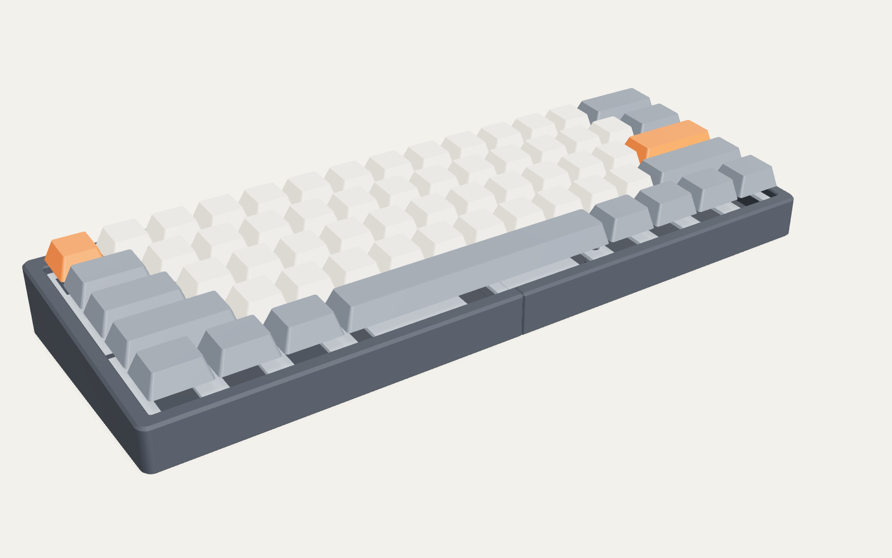
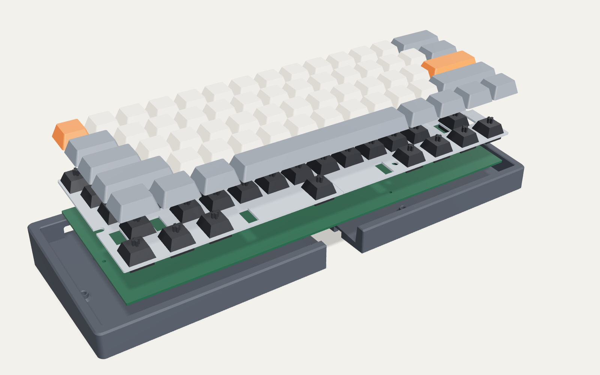
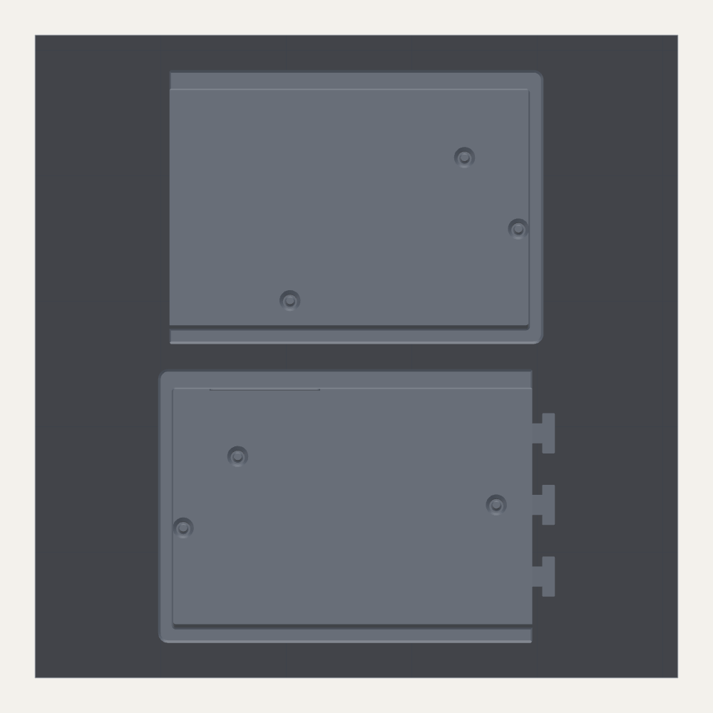
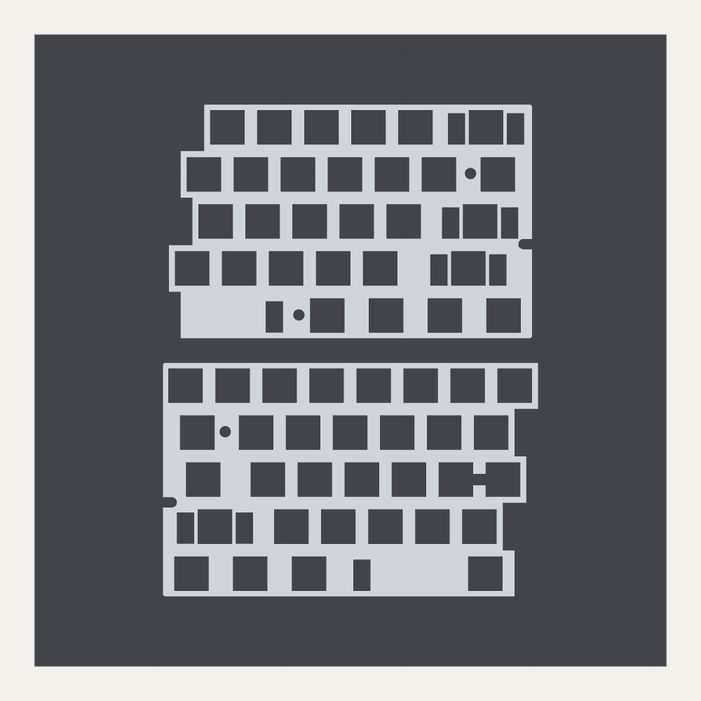
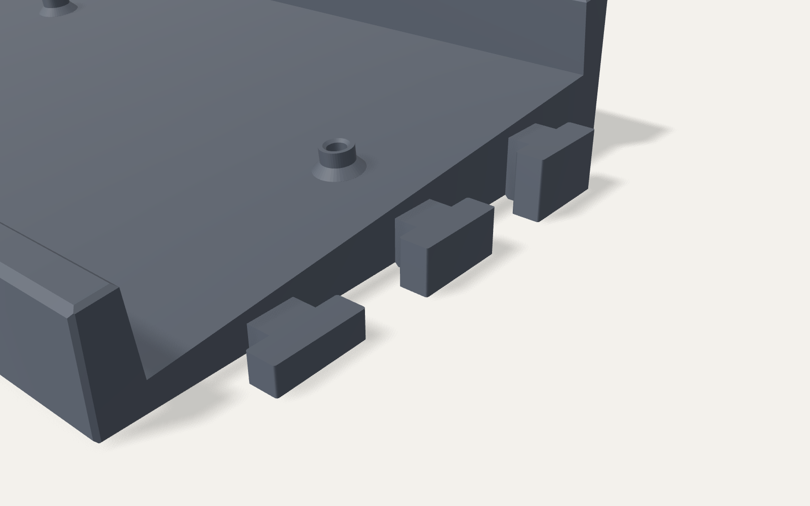
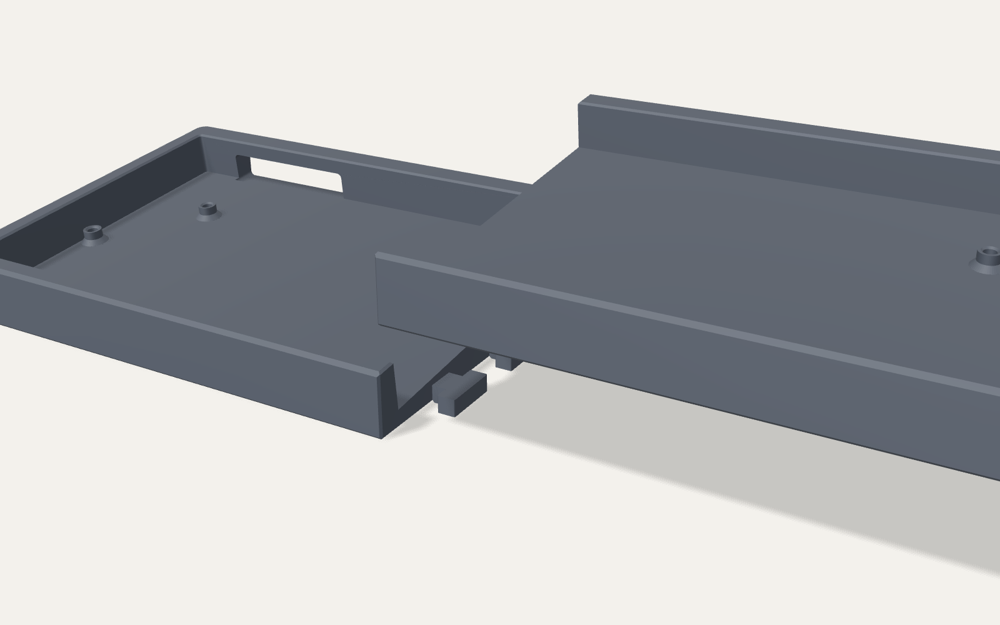

# KB60: a 60% keyboard case + plate for the Bambu Lab X1C



A GH60-compatible, tray-mount 60% case and MX switch plate, designed to print
on a 256 × 256 mm bed (X1C, and also X1E / P1S / P1P). A 60% board is about
296 mm wide, so the case and the plate each split into two halves:

- **Case halves** slide together on three vertical T-keys hidden in the floor.
  No screws or glue are needed, and the seam can open by at most 0.15 mm.
  The seam sits in a small V-groove, so it reads as a design line.
- **Plate halves** split along key boundaries, so every switch cutout is whole
  and the seam hides under the keycaps. The switches and PCB lock the halves together.
- **Everything prints flat, in the orientation provided, with no supports.**

It is fully parametric (`keyboard60.scad`), and every exported part is checked
by `verify.py` (67 automated fit/interference checks, all passing).

| | |
|---|---|
| Outside size | 298.0 × 109.1 mm, 17.9 mm tall at the front, 29.4 mm at the back |
| Typing angle | 6° (parameter) |
| Mounting | Tray mount, 6 × M2 standoffs at the standard GH60 / Poker hole positions |
| Fits | GH60-style 60% PCBs (DZ60, DZ60RGB, BM60, XD60, GH60 …), ANSI or Tsangan plate |
| Plate | 1.5 mm, 14.0 mm MX cutouts, PCB-mount stabilizer cutouts |
| USB | Wide slot at the back left; fits a USB-C port centred 21–51 mm from the PCB's left edge |
| Filament | Case ≈ 170 g (Bambu defaults) to ≈ 320 g (recommended heavy settings); plate ≈ 26 g |



## What you need

- **PCB**: any 60% PCB with the standard GH60 mounting holes (285 × 94.6 mm).
  Hot-swap or solder both work.
- **Switches**: 61 MX-style switches for ANSI (60 for Tsangan).
- **Stabilizers**: PCB-mount (screw-in), 4 × 2u plus 1 × 6.25u (ANSI) or 7u (Tsangan).
- **Screws**: 6 × M2 × 4 mm pan or button head, head Ø ≤ 4 mm.
- **Inserts**: 6 × M2 heat-set inserts made for a Ø3.2 mm hole (e.g. M2 × 3 mm long).
  No inserts? Print the `*_selftap` case halves and drive the M2 screws straight into the plastic.
- **Feet**: 4 × stick-on rubber feet, Ø10–12 mm.
- **Optional**: 2 mm foam sheet (or TPU) for the case foam, and CA glue if you want the seam permanent.
- **Keycaps**: a standard 60% set.

## Files

| Path | What |
|---|---|
| `print/kb60_0_fit_tests.3mf` | Switch-fit and seam-joint test coupons: **print these first** (~15 g) |
| `print/kb60_1_case.3mf` | Both case halves laid out on one 256 mm bed (heat-set insert version) |
| `print/kb60_1_case_selftap.3mf` | Same, with Ø1.8 mm holes for self-tapping M2 screws |
| `print/kb60_2_plate_ansi.3mf` | Both ANSI plate halves on one bed |
| `print/kb60_2_plate_tsangan.3mf` | Tsangan (7u spacebar) plate halves |
| `print/kb60_3_foam_tpu.3mf` | Optional 2 mm case foam, printed in TPU |
| `stl/` | Every part as a separate STL |
| `dxf/plate_*.dxf` | 1:1 one-piece plate outlines, for laser/CNC cutting or checking against your PCB |
| `dxf/case_foam.dxf` | Template for cutting case foam from a sheet |
| `keyboard60.scad` | Parametric source (OpenSCAD 2021.01 or newer) |
| `build.py`, `verify.py`, `package.py` | Export all parts → run the checks → write the 3MF bed layouts |

The 3MFs are plain 3MF (geometry only). Bambu Studio will say the file isn't
from Bambu Lab and load the geometry, already arranged on the bed.

<p> </p>

## Printing on the X1C

| Part | Material | Bambu Studio process | Walls / infill | Notes |
|---|---|---|---|---|
| Fit tests | Same as the real part | Same as the real part | — | Print before anything else |
| Plate halves | PLA (stiffer), or PETG for a softer feel | **0.16mm Optimal** (gives a 1.48 mm plate) | 3 walls | Smooth or textured PEI |
| Case halves | PETG or ASA; PLA Matte if it stays out of hot cars | 0.16mm Optimal (smoother rim) or 0.20mm Standard | 4 walls, 40% gyroid (weight = better sound) | Textured PEI gives a nice underside. Add a brim for ASA |
| Foam (optional) | TPU 95A from the external spool | 0.20mm Standard | 2 walls, 15% gyroid | Or cut `case_foam.dxf` from 2 mm foam |

No supports are needed anywhere. The USB slot top and the joint slots are short
bridges that the X1C handles well.

**Order of work:**

1. **Fit tests** (~20 min). The switch coupon has three 1u holes at 13.9 / 14.0 / 14.1 mm,
   marked with 1 / 2 / 3 dots, plus a 2u stabilizer cutout. A switch should click in
   firmly in hole 2. If it only fits hole 3, set **X-Y hole compensation** to +0.05 mm
   in Bambu Studio. If hole 1 is already loose, set it to −0.05 mm. Use the same setting
   for the plate. For the joint coupon, lower the right block onto the left one: it
   should slide down by hand with no wobble. If it's tight, use the same hole
   compensation trick on the case.
2. **Plate** (~1 h). Before committing to the long case print, lay the plate halves on
   your PCB. The switch cutouts must line up with the switch footprints, and the six
   screw holes/notches with the PCB's six mounting holes.
3. **Case**: both halves on one bed. This is the long job, typically an overnight print;
   Bambu Studio shows the exact estimate.

## Assembly

1. **Inserts.** Press an M2 heat-set insert into each of the 6 standoffs with a soldering
   iron, flush with the top. Skip this for the self-tap case.
2. **Join the case.** Set the left half on the desk. Hold the right half above it with its
   slots over the three T-keys and lower it straight down. For a permanent joint, put a few
   drops of CA glue on the seam faces first.
3. **Optional foam.** Lay the 2 mm foam on the floor.
4. **Build the PCB stack.** Fit the stabilizers to the PCB. Lay both plate halves on the
   PCB, then press switches through the plate into the PCB (hot-swap) or solder them.
   A few switches near the seam hold the two plate halves in line. Test the board.
5. **Drop it in.** Lower the PCB + plate into the case with the USB port toward the back
   slot, pushing it straight in along the tilt. Drive the 6 M2 screws through the plate's
   access holes into the standoffs.
6. Keycaps on, rubber feet into the four recesses underneath, done.




## Customising

Open `keyboard60.scad` in OpenSCAD and use the Customizer, or override values
from the command line and rebuild everything consistently:

```bash
pip install numpy scipy trimesh shapely manifold3d networkx
python3 build.py -D typing_angle=7 -D 'usb_style="custom"' -D usb_center=31
python3 verify.py -D typing_angle=7 -D 'usb_style="custom"' -D usb_center=31
python3 package.py
```

Useful parameters:

| Parameter | Default | Notes |
|---|---|---|
| `typing_angle` | 6 | Degrees |
| `rim_above_plate` | 3 | Raise it for a taller, more enclosed look |
| `bezel_side` / `bezel_front` / `bezel_back` | 6 / 6 / 8 | Wall widths at the rim |
| `usb_style` | `universal` | Set `custom` plus `usb_center` (mm from the PCB's left edge) for a single, tidy port opening |
| `standoff_hole_diameter` | 3.2 | 3.2 for M2 heat-set inserts, 1.8 to self-tap |
| `layout` | `ansi` | `tsangan` for the 7u bottom row |
| `stab_style` | `pcb` | `cherry` gives exact Cherry-spec cutouts for plate-mount stabilizers |
| `switch_cutout` | 14.0 | Prefer tuning fit with X-Y hole compensation in the slicer |
| `key_clearance` | 0.15 | Seam joint fit |

The `.scad` is plain OpenSCAD, so it should also run in MakerWorld's Parametric Model Maker.

To regenerate the images: run `npm install three playwright` in `tools/render`,
serve this folder (`python3 -m http.server 8765`), then run
`node shoot.mjs 8765 ../../images hero exploded`.

## Design notes

- **Tray mount.** The case holds the PCB and the plate rides on the switches, as in most
  60% cases, so any GH60-style PCB drops straight in.
- **Stack.** The PCB sits 4.0 mm above the floor. That leaves room for hot-swap sockets
  (1.85 mm), a bottom-mounted USB-C port and 2 mm foam. The plate's top is 5.0 mm above
  the PCB (MX standard), and the rim is 3.0 mm above the plate.
  The cavity walls are square to the tilted plate, so the 0.5 mm edge clearance is the same
  at every height. A fully pressed keycap stops level with the rim and never touches the case.
- **GH60 mounting holes** (mm from the PCB centre; +x right, +y toward you):
  (−139, 9.2), (−117.3, −19.4), (−14.3, 0), (48, 37.9), (117.55, −19.4), (139, 9.2).
  Each one lands in a gap between switches in the ANSI and Tsangan layouts. The G/H hole's
  plate opening joins the two neighbouring switch cutouts, which doesn't matter because MX
  clips grip the other two sides.
- **Stabilizers.** Stab centres are ±11.938 mm (2–2.75u), ±50 mm (6.25u) and ±57.15 mm (7u).
  The cutouts are the Cherry spec, 6.65 × 12.3 mm (5.53 mm behind / 6.77 mm in front of
  the switch centre), widened to 7.0 × 12.7 mm by default so PCB-mount stab housings pass
  through a printed plate easily.
- **Seam joint.** Three T-keys (8 mm neck, 16 mm head) with 0.15 mm clearance on every face.
  Their square shoulders limit seam opening to the clearance. A dovetail was tried first,
  but its shallow angle turned 0.15 mm of clearance into 0.6 mm of play.
- **Thinnest plate web**: 0.98 mm, beside the Enter stabilizer at the right-edge screw notch.
  Everywhere else it is at least 1.44 mm.

## Verification

`verify.py` loads the exported meshes and places them where they sit in the assembled
keyboard. It then checks:

- every part is a watertight, valid solid that fits the X1C and sits flat;
- both halves of each job fit on one bed;
- the case halves, PCB, plate, switches, foam and keycaps (at rest and fully pressed) don't collide;
- the PCB rests on all six standoffs;
- an M2 screw head and driver pass each plate hole, and the shank enters each PCB hole and insert hole;
- the seam keys allow 0.1 mm of slack but lock before 0.2 mm;
- a 12.4 × 6.5 mm USB-C overmold reaches the port anywhere from 21 to 51 mm (bottom- and mid-mount);
- the thinnest plate web is at least 0.9 mm.

Current result: **67/67 checks pass.**

**Not yet test-printed.** These checks are computational. Please print the fit tests
and the plate first (that is what they're for) and compare the plate against your
PCB before the long case print. The GH60 hole positions and Cherry stabilizer dimensions
are the standard values, cross-checked against each other and the key layout, but not yet
measured against a physical PCB.
