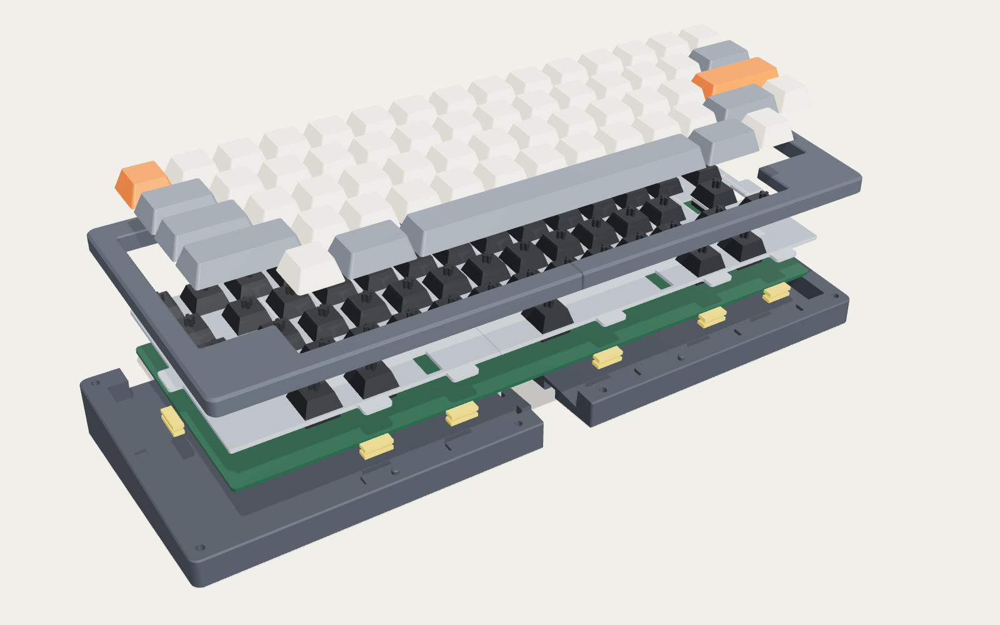
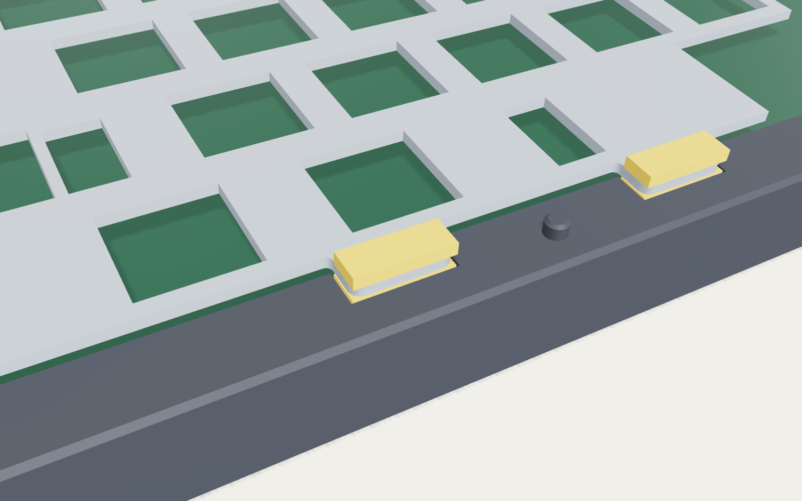
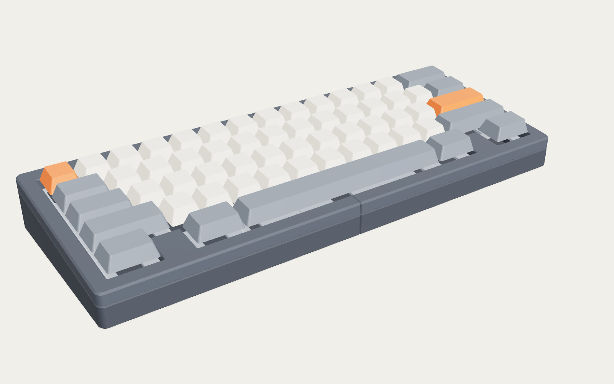
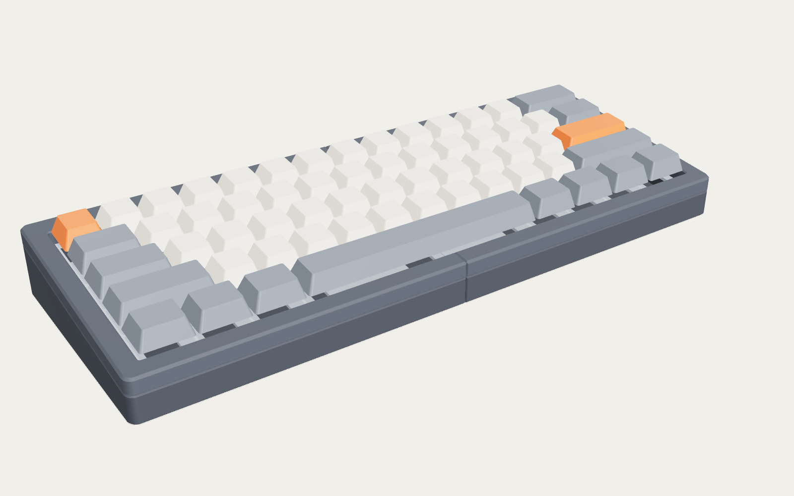
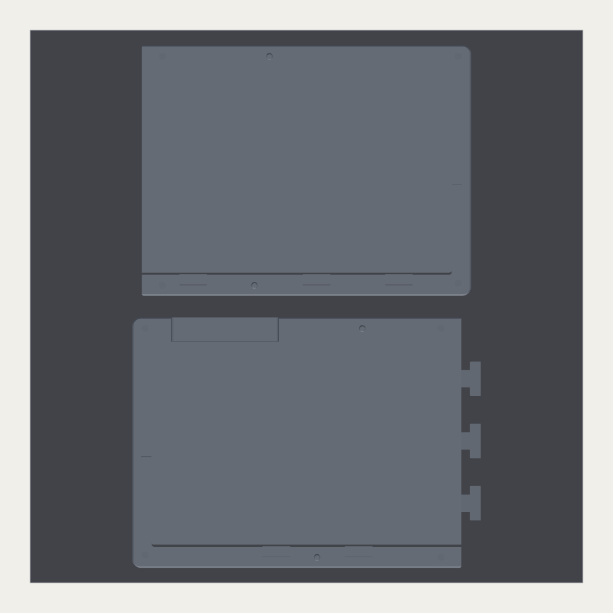
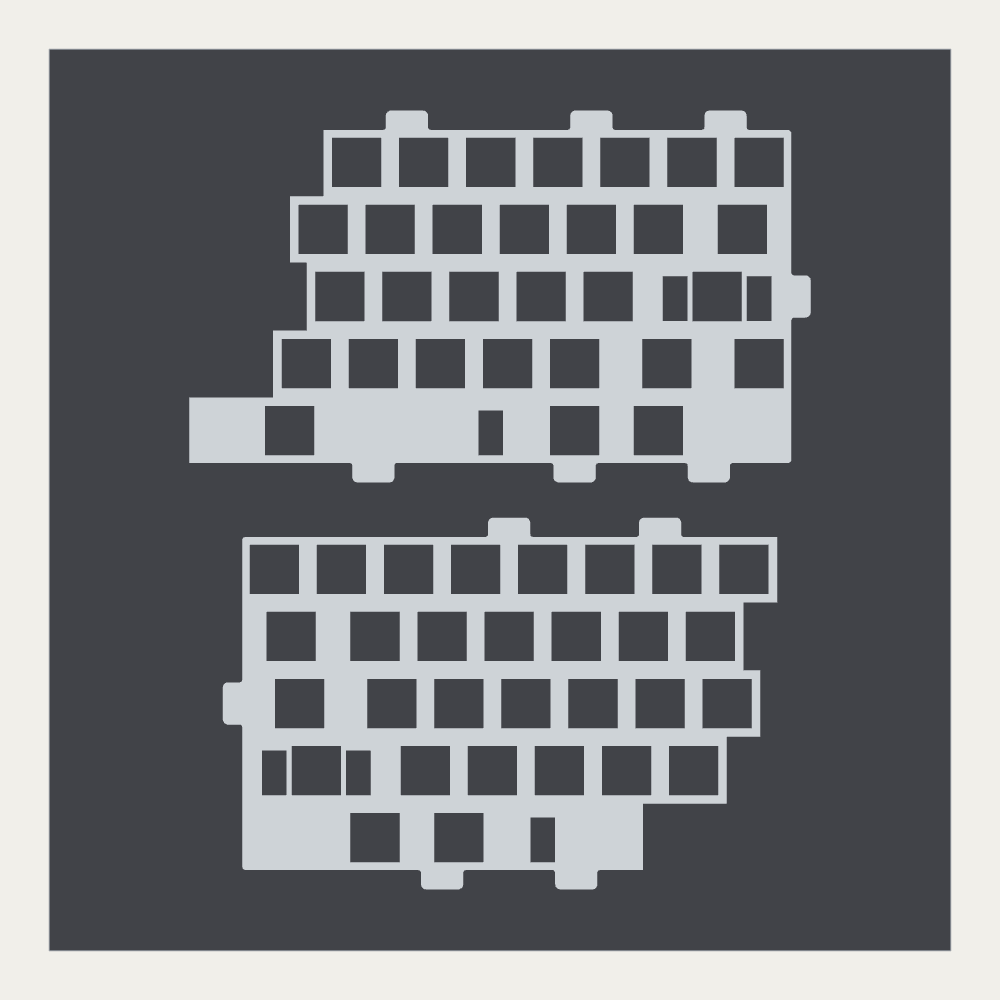
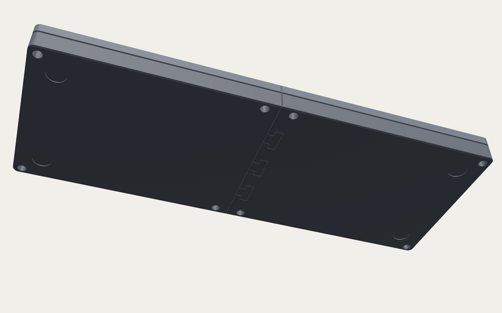

# Monaka60


A 3D-printable, gasket-mounted 60% keyboard, built for the 256 × 256 mm bed of the
Bambu Lab X1C (it also fits the X1E, P1S and P1P). The name comes from *monaka*, a
Japanese sweet made of two crisp wafer shells around a soft filling. Here the shells
are the printed top and bottom case, and the filling is a switch plate floating on
gasket pads.

- **Gasket mount.** Twelve tabs on the plate sit between 2 mm gasket pads, clamped by
  the top and bottom case. Eight M3 screws go in from underneath, so none show.
- **Any standard 60% PCB.** The PCB hangs from the switches and its mounting holes are
  not used, so hineybush h60, DZ60, BM60, XD60 and other GH60-style boards all fit. USB-C
  on the PCB works, and so does a Unified Daughterboard for JST boards like the h60
  hot-swap.
- **Four layouts, two sets of blockers.** ANSI, Tsangan, WKL and HHKB plates. The top
  case carries the WKL or HHKB blockers as part of the rim.
- **Made for the printer.** Every part prints flat without supports. The case and plate
  split into halves to fit the bed. `verify.py` runs 58 fit and interference checks on
  the exported meshes, and all of them pass.

| | |
|---|---|
| Outside | 305 × 116.1 mm, 20.6 mm tall at the front, 32.8 mm at the back |
| Typing angle | 6°, built in |
| Mount | Gasket: 12 plate tabs, 2 mm pads above and below each, squeezed to 1.65 mm |
| PCB | Standard 60%, 285 × 94.6 mm, floating 4 mm above the floor |
| Plate | 1.5 mm, 14.0 mm MX cutouts, PCB-mount stabilizer cutouts |
| Layouts | ANSI (6.25u), Tsangan (7u), WKL (7u + blockers), HHKB (7u + blockers, split backspace and right shift) |
| USB | USB-C on the PCB: port centred 15–51 mm from the PCB's left edge (the GH60 standard is 18.2). Or a Unified Daughterboard C3/C4 |
| Hardware | 8 × M3 × 10 socket head screws, 8 × M3 heat-set inserts, 24 gasket pads, 4 rubber feet |
| Filament | Case ≈ 210 g (Bambu defaults) to ≈ 400 g (recommended heavy settings); plate ≈ 28 g |



## Why gasket mount

Tray mount, used in the first version of this design, screws the PCB straight to
standoffs in the case. In a light plastic case that transmits every keystroke into the
shell. The result is the hollow, pingy sound printed keyboards are known for, plus
stiff spots over each screw. Here is how the common mounts compare for FDM printing:

| Mount | How it holds the plate | Feel and sound | How well it suits a printer |
|---|---|---|---|
| Tray | PCB screwed to case standoffs | Stiff, uneven, bright and pingy | Poor. The shell resonates, and the fit depends on the PCB's screw holes |
| Top / bottom | Plate screwed directly to the case | Firm, consistent | Fair. Needs precise screw bosses and stays rigid |
| **Gasket** | **Plate tabs clamped between soft pads** | **Soft, even, deep and muted** | **Best.** Pads absorb print tolerances and decouple the shell; they can be printed in TPU; the top case can carry blockers; no PCB holes needed |
| O-ring (gummy) | O-ring around plate + PCB, friction fit in a one-piece tub | Soft and bouncy | Very good and the simplest, but the board has to drop in from above, so the case can't have blockers |
| Leaf spring | Flexible plate arms screwed to the case | Soft, very even | Risky. Printed PLA springs creep over time |

The pads (Poron, EVA, or printed TPU) absorb the ±0.1–0.2 mm variation of printed
parts. The clamp gap is set by layer heights, which FDM holds very precisely. A 1.5 mm
printed plate is about as stiff as the POM and polycarbonate plates used in commercial
gasket builds.



## Layouts and blockers

| Layout | Plate | Top case | h60 QMK layout |
|---|---|---|---|
| ANSI | `plate_ansi` | `top_open` | `60_ansi` |
| Tsangan | `plate_tsangan` | `top_open` | `60_ansi_tsangan_split_bs_rshift` bottom row |
| WKL | `plate_wkl` | `top_wkl` (1u blockers beside the 1.5u mods) | Tsangan bottom row, 1u keys left empty |
| HHKB | `plate_hhkb` | `top_hhkb` (1.5u blockers in both corners) | `60_hhkb` |

The layouts match the key positions in the h60's QMK definition. Blockers stand
5 mm tall and sit 1 mm above the plate, and their faces leave the same 1.1 mm keycap
gap as the case walls.

<p> </p>

## PCB compatibility

- **Outline.** Standard 285 × 94.6 mm GH60 outline (checked against the original GH60
  KiCad file). A 1 mm gap all round lets the board float.
- **USB-C on the PCB** (h60 USB version, DZ60, BM60…). The bottom case has a slot at the
  back left, open to the top case. It fits a 12.4 × 6.5 mm plug overmold on a port
  centred anywhere from 15 to 51 mm from the PCB's left edge. That covers the GH60
  standard position of 18.2 mm, on a bottom- or mid-mounted receptacle, even with the
  plate flexed 1 mm.
- **JST + daughterboard** (h60 JST and hot-swap + daughterboard versions). Print
  `bottom_left_udb`. It holds a Unified Daughterboard C3/C4 (18 × 16.5 mm, 4 × M2 on
  14 × 12.5 mm) in a pocket in the floor, with its port behind a single tidy opening
  18.2 mm from the PCB's left edge. The board sits low enough that the PCB can flex 1 mm
  without touching it. If your PCB's JST connector sits right above that spot, move it
  with `udb_port_x`.

## What you need

| Qty | Part |
|---|---|
| 1 | 60% PCB with the standard outline: hineybush h60, DZ60, BM60, XD60… hot-swap or solder |
| 58–61 | MX-style switches: ANSI 61, Tsangan 60, WKL 58, HHKB 60 |
| 5 | PCB-mount stabilizers: 4 × 2u + 1 × 6.25u (ANSI) or 7u (others). HHKB uses 2 × 2u + 1 × 7u |
| 8 | M3 × 10 mm socket head screws (DIN 912) |
| 8 | M3 heat-set inserts for a Ø 4.0 mm hole, about 4 mm long |
| 24 | Gasket pads 12.3 × 4.4 × 2 mm: print `gaskets_tpu`, or cut them from 2 mm Poron/EVA (template `dxf/gasket_pad.dxf`) |
| 4 | Stick-on rubber feet, Ø 10–12 mm |
| (1) | Unified Daughterboard C3/C4, JST cable and 4 × M2 × 4 screws, only for the `udb` bottom case |

## Files

| Path | What |
|---|---|
| `print/monaka60_0_fit_tests.3mf` | Switch-fit coupon, seam-joint coupon, gasket-stack coupon. **Print these first** |
| `print/monaka60_1_bottom.3mf` | Both bottom halves on one bed (USB-C slot) |
| `print/monaka60_1_bottom_udb.3mf` | Same, with the daughterboard pocket instead of the slot |
| `print/monaka60_2_top_{open,wkl,hhkb}.3mf` | Top case halves, upside down on the bed |
| `print/monaka60_3_plate_{ansi,tsangan,wkl,hhkb}.3mf` | Plate halves |
| `print/monaka60_4_gaskets_tpu.3mf` | 24 gasket pads in TPU |
| `print/monaka60_5_foam_tpu.3mf` | Optional 2 mm case foam in TPU (or cut `dxf/case_foam.dxf` from foam sheet) |
| `stl/` | Every part as a separate STL, in print orientation |
| `dxf/` | One-piece plates with tabs (for laser or CNC cutting), foam and gasket templates |
| `monaka60.scad` | The parametric source (OpenSCAD 2021.01 or newer) |
| `build.py`, `verify.py`, `package.py` | Export everything → run the checks → write the bed layouts |

The 3MFs are plain 3MF. Bambu Studio loads the geometry already laid out on the bed.

<p>  </p>

## Printing on the X1C

| Part | Material | Bambu Studio process | Walls / infill | Notes |
|---|---|---|---|---|
| Fit tests | Same as the real parts | Same as the real parts | — | Print before anything else |
| Bottom case | PETG or ASA (PLA Matte if it stays indoors) | 0.20mm Standard | 4 walls, 40% gyroid | Weight helps the sound. Textured PEI |
| Top case | Same as the bottom | 0.16mm Optimal | 4 walls, 40% gyroid | Prints upside down, so the rim gets the plate's texture |
| Plate | PLA (stiffer) or PETG (softer) | 0.16mm Optimal (gives 1.48 mm) | 3 walls | |
| Gaskets, foam | TPU 95A from the external spool | 0.20mm Standard | 2 walls, 20% gyroid | Or use Poron / EVA sheet |

No supports anywhere. The case halves come within 6 mm of the bed's front and back
edges. If you print ASA with a brim, print one half at a time.

1. **Fit tests** (~1 h).
   - **Switch coupon:** the 1u holes are 13.9 / 14.0 / 14.1 mm (1 / 2 / 3 dots), and a
     switch should click firmly into hole 2. If only hole 3 fits, set **X-Y hole
     compensation** to +0.05 mm; if hole 1 is already loose, −0.05 mm.
   - **Joint coupon:** the right block should drop onto the left one by hand.
   - **Gasket coupon:** put a pad, the tab strip and a pad in the pockets and close the
     blocks with an M3 × 10. The stack should squeeze, not bottom out, and the insert
     should sit flush.
2. **Plate** (~1 h). Lay it on your PCB before the case prints. The switch cutouts
   should line up with the switch footprints.
3. **Top case**, then **bottom case**: two overnight jobs. Bambu Studio shows the exact
   times.

## Assembly

1. **Inserts.** Press an M3 heat-set insert into each of the 8 holes on the underside of
   the top case halves, flush with the surface.
2. **Membranes.** Each counterbore under the bottom case is capped by a 0.3 mm printed
   layer so it bridges cleanly. Push through it with the screw or a 3 mm drill.
3. **Join the bottom case.** Set the left half down and lower the right half straight
   onto its three T-keys. Add a few drops of CA glue if you want it permanent.
4. **Daughterboard** (`udb` version only). Screw it into its pocket with 4 × M2 × 4 and
   plug in the JST cable.
5. **PCB stack.** Fit the stabilizers, lay both plate halves on the PCB and press the
   switches through. A few switches near the seam lock the halves together. Test the
   board.
6. **Gaskets.** Put one pad in each pocket along the bottom case rim. Lower the PCB
   stack in so every tab lands on a pad, then put a pad on top of each tab.
7. **Close.** Lower the top case halves (pegs into holes), flip the keyboard, and drive
   the 8 screws from underneath. Tighten them evenly until the top case seats; the pads
   set the squeeze.
8. Keycaps on, rubber feet into the recesses underneath.



## Customising

Open `monaka60.scad` in OpenSCAD and use the Customizer, or override values on the
command line and rebuild everything consistently:

```bash
pip install numpy scipy trimesh shapely manifold3d networkx
python3 build.py -D typing_angle=7 -D rim_above_plate=5
python3 verify.py -D typing_angle=7 -D rim_above_plate=5
python3 package.py
```

| Parameter | Default | Notes |
|---|---|---|
| `layout` | `ansi` | `tsangan`, `wkl`, `hhkb` |
| `blockers` | `auto` | Follows the layout, or force `none` / `wkl` / `hhkb` |
| `connector` | `usb` | `udb` for a daughterboard |
| `usb_slot_from` / `usb_slot_to` | 8 / 58 | USB slot extent, mm from the PCB's left edge |
| `gasket_thickness` / `gasket_squeeze` | 2.0 / 0.35 | Match your gasket material |
| `typing_angle` | 6 | Degrees |
| `rim_above_plate` | 6 | Lower for a more open look (blockers get shorter) |
| `stab_style` | `pcb` | `cherry` gives exact Cherry-spec cutouts for plate-mount stabilizers |

To regenerate the images: run `npm install three playwright` in `tools/render`, run
`python3 -m http.server 8765` from this folder, then from `tools/render` run
`node shoot.mjs 8765 ../../images hero_hhkb exploded`.

## Design notes

- **Stack.** The PCB floats 4.0 mm above the floor. The plate top is 5.0 mm above the
  PCB (MX standard) and the rim is 6.0 mm above the plate. At rest the keycaps clear the
  rim; fully pressed they dip 3 mm into the opening with a 1.1 mm gap to walls and
  blockers.
- **Gaskets.** Pockets hold 2 mm pads squeezed to 1.65 mm (18%) above and below each
  tab. Tabs have 0.4 mm of sideways clearance, which is how far the plate can float.
  Every keycap still clears the walls and blockers with the plate pushed 0.35 mm in any
  direction.
- **Parting line.** The top and bottom case meet at the plate's underside, with a
  0.6 mm chamfer on both edges so the seam reads as a shadow line. The USB-C slot is a
  notch open to that plane, so it needs no bridging.
- **Seams.** The case halves meet on the centre line, where a V-groove makes the seam
  look deliberate. The bottom halves lock on three T-keys with square shoulders (0.15 mm
  clearance). The top halves are held by pegs and the screws beside the seam. The plate
  splits along key boundaries, placed so no gasket tab is cut.
- **Screws.** Vertical M3 × 10: 6 mm clamp through the bottom case, 4 mm into the
  insert.

## Verification

`verify.py` loads the exported meshes, places them where they sit in the finished
keyboard, and checks:

- every part is a valid solid that sits flat and fits the bed;
- the case halves, top and bottom case, PCB, plate, switches, gaskets and foam don't collide;
- keycaps clear the case at rest and fully pressed, including with the plate floated sideways;
- the plate can sink into its gaskets, and the blockers stay 0.9 mm clear above it;
- the PCB can flex 1 mm without touching the floor or the daughterboard;
- the seam keys have slack but lock before 0.2 mm;
- the screw heads seat and each shank reaches its insert;
- USB-C plugs reach every supported port position, including the daughterboard's;
- the thinnest plate web is 1.44 mm.

These checks run for all four layouts. Current result: **58/58 pass.**

**Not yet test-printed.** The checks are computational. Print the fit tests and the
plate first, and compare the plate against your PCB before the long case prints.

Reference data: the h60 layouts come from its QMK definition (`keyboards/hineybush/h60`).
The GH60 outline and USB position come from the original GH60 KiCad file
(`komar007/gh60`). The daughterboard geometry comes from the Unified Daughterboard C3
KiCad file (`Unified-Daughterboard/UDB-C-Legacy`).
